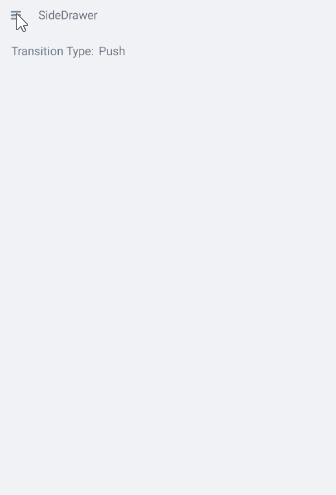
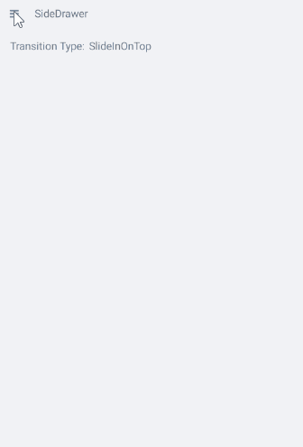
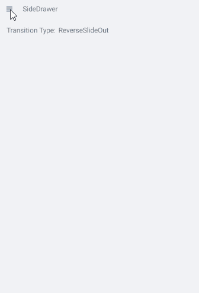

# Transitions

Transitions are the animation effects applied to the side drawer while it is being opened and closed.

## Built-in Transitions

RadSideDrawer exposes several predefined transitions that can be used by customers. The desired transition can be set through **DrawerTransitionType** property of the SideDrawer. 

DrawerTransitionType is enumeration which exposes the following members:

* **Push** (the default one)
* **Fade**
* **Reveal**
* **ReverseSlideOut**
* **ScaleUp**
* **SlideAlong**
* **SlideInOnTop**
* **Custom**

Here is a sample snippet on how you can set **DrawerTransitionType** property of RadSideDrawer:

```XAML
<telerikPrimitives:RadSideDrawer x:Name="sideDrawer" 
                                 DrawerTransitionType="SlideInOnTop">
    <telerikPrimitives:RadSideDrawer.MainContent>
		<StackLayout Orientation="Horizontal">
			<Label Text="Transition Type:" />
			<Label Text="SlideInOnTop" />
		</StackLayout>
    </telerikPrimitives:RadSideDrawer.MainContent>
    <telerikPrimitives:RadSideDrawer.DrawerContent>
		<Grid WidthRequest="220">
			<ListView x:Name="drawerList">
				<ListView.ItemsSource>
					<x:Array Type="{x:Type x:String}">
						<x:String>Inbox</x:String>
						<x:String>Drafts</x:String>
						<x:String>Sent Items</x:String>
					</x:Array>
				</ListView.ItemsSource>
			</ListView>
		</Grid>
    </telerikPrimitives:RadSideDrawer.DrawerContent>
</telerikPrimitives:RadSideDrawer>
```

>tip In addition to the transition type, you can also control the transition duration and opacity value through **DrawerTransitionDuration** and **DrawerTransitionFadeOpacity** properties, respectively. For more details on this go to [Properties]() topic.

### Examples

Check below some of the predefined transitions of RadSideDrawer:

* Default Push transition:

	

* SlideInOnTop transition - the drawer goes over the main content:

	

* ReverseSlideOut transition:

	

>important A sample Transitions examples can be found in the SideDrawer/Features folder of the [SDK Samples Browser application]().

## Create Custom Transition

If however, non of these predefined transitions fits users' scenario they are allowed to create custom animation effect. Next is a demonstration of how customers can create their own transition.

1. Set the **DrawerTransitionType** property to **Custom**. 
1. Create custom SideDrawerRenderer (in both Android and iOS platforms) which will allow customers to apply custom transition.
1. Create a class for each platform and register your custom renderer using the ExportRenderer assembly level attribute.

### Create Custom Transition in Android

Creating custom renderer is simple. Just create a class and derive it from the **SideDrawerRenderer**. Furthermore, customers should override the **CreateFadeLayer()** and **CreateCustomTransition()** methods. Those methods are the necessary extensibility points for such customization. Here is a sample implementation of a custom renderer:

```C#
public class CustomSideDrawerRenderer : SideDrawerRenderer
{
    protected override Native.IDrawerFadeLayer CreateFadeLayer()
    {
        return new Native.BlurFadeLayer(Forms.Context, RenderScript.Create(Forms.Context))
        {
            Background = new Drawables.ColorDrawable(Color.FromRgb(255, 200, 255).ToAndroid())
        };
    }

    protected override Native.IDrawerTransition CreateCustomTransition()
    {
        return new FallDownTransition();
    }
}
```

>important **BlurFadeLayer** requires reference to **Xamarin.Android.Support.v8.RenderScript**

Once users have this class created, they need to register the renderer:

```C#
[assembly: ExportRenderer(typeof(RadSideDrawer), typeof(CustomSideDrawerRenderer))]
```

This must replace the registration of our **SideDrawerRenderer**

### Create Custom Transition in iOS

In iOS the creation of custom animation effect is very similar to the process in Android. The steps are the same but are executed in a bit different way.

Create a class and derive it from the **SideDrawerRenderer**

When creating the custom renderer users should override only the **CreateCustomTransition()** method. Here is a sample implementation:

```C#
public class CustomSideDrawerRenderer : SideDrawerRenderer
{
    protected override TKSideDrawerTransition CreateCustomTransition(TKSideDrawer drawer)
    {
        return new CustomTransition(drawer);
    }
}
```

Once users have this class created, they need to register the renderer:

```C#
[assembly: ExportRenderer(typeof(RadSideDrawer), typeof(CustomSideDrawerRenderer))]
```

## See Also

- [Properties]()
- [Commands]()