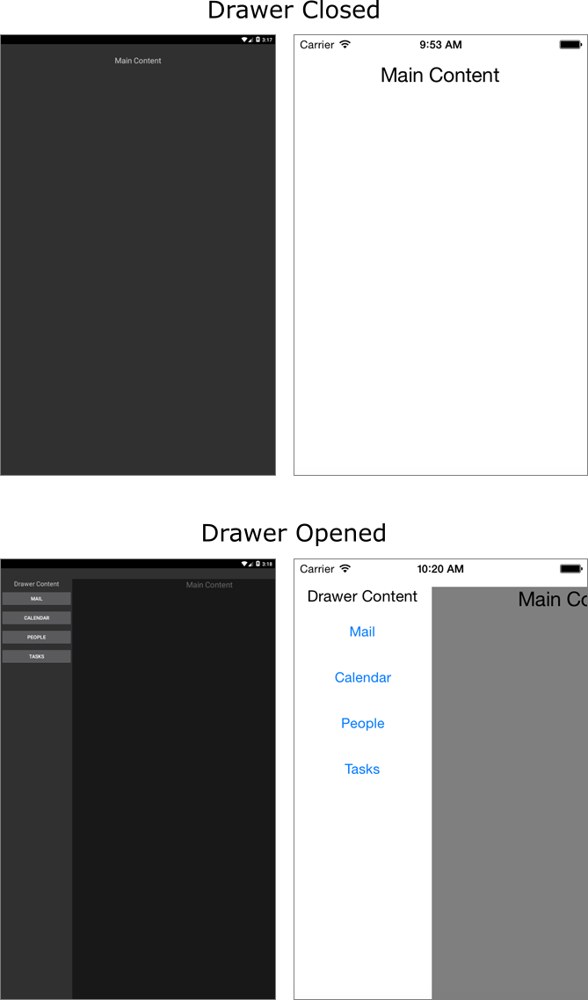

# Introduction

This article will guide users through the steps that have to be taken in order to use the RadSideDrawer in a project.

# Getting Started

Once users create the blank **Xamarin.Forms** solution, they need to add references to the following binaries in order to include the **RadSideDrawer** into their project:

* **Portable** (if you have created Xamarin.Forms Portable App)
	- Telerik.XamarinForms.Primitives.dll
	- Telerik.XamarinForms.Common.dll
* **Android**
	- Telerik.Xamarin.Android.Common.dll
	- Telerik.Xamarin.Android.Primitives.dll
	- Telerik.XamarinForms.Primitives.dll
	- Telerik.XamarinForms.Common.dll
	- Telerik.XamarinForms.PrimitivesRenderer.Android.dll
* **iOS**
	- Telerik.Xamarin.iOS.dll
	- Telerik.XamarinForms.Common.dll
	- Telerik.XamarinForms.Primitives.dll
	- Telerik.XamarinForms.PrimitivesRenderer.iOS.dll
* **WinPhone**

	> **RadSideDrawer** is not available for **Windows Phone**.

When the references are added, you can proceed with defining the component:

	<primitives:RadSideDrawer>
	  <primitives:RadSideDrawer.DrawerLength>
	    <OnPlatform x:TypeArguments="x:Double" iOS="150" Android="200"/>
	  </primitives:RadSideDrawer.DrawerLength>
	  <primitives:RadSideDrawer.MainContent>
	    <Label Text="Main Content" FontSize="Large" HorizontalOptions="Center"/>
	  </primitives:RadSideDrawer.MainContent>
	  <primitives:RadSideDrawer.DrawerContent>
	    <StackLayout>
	      <Label Text="Drawer Content" FontSize="Medium" HorizontalOptions="Center"/>
	      <Button Text="Mail"/>
	      <Button Text="Calendar"/>
	      <Button Text="People"/>
	      <Button Text="Tasks"/>
	    </StackLayout>
	  </primitives:RadSideDrawer.DrawerContent>
	</primitives:RadSideDrawer>

Where the *primitives* namespace is defined like this:

	xmlns:primitives="clr-namespace:Telerik.XamarinForms.Primitives;assembly=Telerik.XamarinForms.Primitives"

