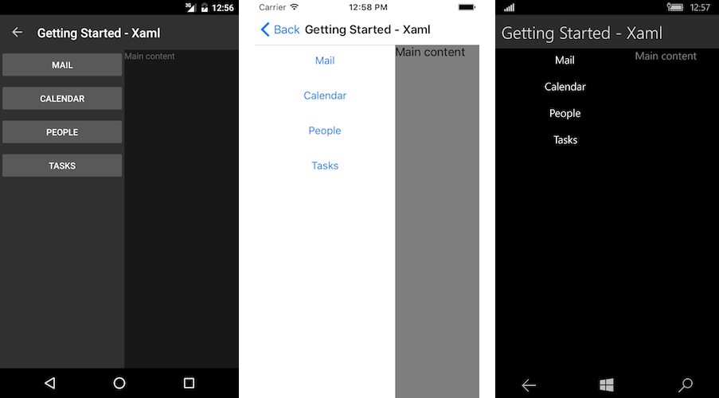

# Getting Started

This article will guide you through the steps needed to add a basic **RadSideDrawer** control in your application.

## 1. Setting up the app

Take a look at these articles and follow the instructions to setup your app:

- [Setup app with Telerik UI for Xamarin on Windows]()
- [Setup app with Telerik UI for Xamarin on Mac]()

## 2. Adding the required Telerik references

You have two options:

* Add the Telerik UI for Xamarin Nuget package following the instructions in [Telerik NuGet package server]() topic.

If you don't want to add the all Telerik.UI.for.Xamarin nuget package, you have the option to add a separate nuget package. For RadSideDrawer control you have to install the **Telerik.UI.for.Xamarin.Primitives** nuget package. This nuget will automatically refer the *Telerik.UI.for.Xamarin.Common* and *Telerik.UI.for.Xamarin.SkiaSharp* nuget packages.

* Add the references to Telerik assemblies manually, check the list below with the required assemblies for **RadSideDrawer** component:

| Platform | Assemblies |
| -------- | ---------- |
| Portable | Telerik.XamarinForms.Common.dll Telerik.XamarinForms.Primitives.dll |
| Android  | Telerik.Xamarin.Android.Common.dll Telerik.Xamarin.Android.Primitives.dll Telerik.XamarinForms.Common.dll Telerik.XamarinForms.Primitives.dll |
| iOS      | Telerik.Xamarin.iOS.dll  Telerik.XamarinForms.Common.dll Telerik.XamarinForms.Primitives.dll |
| UWP      | Telerik.Core.dll Telerik.UI.Xaml.Primitives.UWP.dll Telerik.XamarinForms.Common.dll Telerik.XamarinForms.Primitives.dll |

## 3. Adding RadSideDrawer control

If your app is setup, you are ready to add a **RadSideDrawer** control.

You can proceed with defining the component. The DrawerContent represents the hidden view (in it you could place navigational UI, any common setting, etc), while the MainContent hosts the main View of your app.

<snippet id='sidedrawer-gettingstarted-xaml'/>
<snippet id='sidedrawer-gettingstarted-csharp'/>

You also have to add the following namespace:

<snippet id='xmlns-telerikprimitives'/>
<snippet id='ns-telerikprimitives'/>

Finally, set the drawer as content of your page.

Here is the result when you set `IsOpen="True"`:
 

>important **SDK Browser** and **QSF** applications contain different examples that show RadSideDrawer's main features. You can find the applications in the **Examples** and **QSF** folders of your local **Telerik UI for Xamarin** installation.

## See Also

- [Properties and Events]()
- [Transitions]()