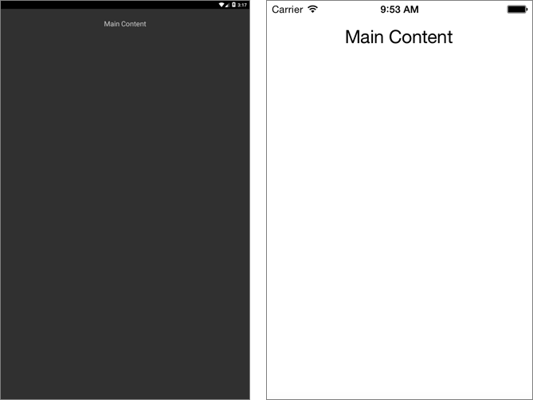
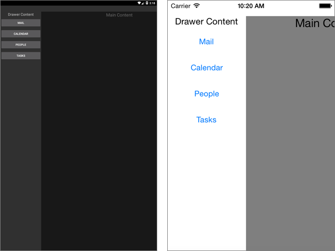

# Introduction

This article will guide users through the steps that have to be taken in order to use the RadSideDrawer in a project.

# Getting Started

Once users create the blank **Xamarin.Forms** solution, they need to add references to the following binaries in order to include the **RadSideDrawer** into their project:

* **Portable** (if you have created Xamarin.Forms Portable App)
	- Telerik.XamarinForms.Primitives.dll
	- Telerik.XamarinForms.Common.dll
* **Android**
	- Telerik.Xamarin.Android.Common.dll
	- Telerik.Xamarin.Android.Primitives.dll
	- Telerik.XamarinForms.Primitives.dll
	- Telerik.XamarinForms.Common.dll
	- Telerik.XamarinForms.PrimitivesRenderer.Android.dll
* **iOS**
	- Telerik.Xamarin.iOS.dll
	- Telerik.XamarinForms.Common.dll
	- Telerik.XamarinForms.Primitives.dll
	- Telerik.XamarinForms.PrimitivesRenderer.iOS.dll
* **WinPhone**

	> **RadSideDrawer** is not available for **Windows Phone**.

You will also have to add the following code to these project files:

* **Android**: MainActivity.cs
* 
		[assembly: Xamarin.Forms.ExportRenderer(typeof(Telerik.XamarinForms.Primitives.RadSideDrawer), typeof(Telerik.XamarinForms.PrimitivesRenderer.Android.SideDrawerRenderer))]
You also need to call `TelerikForms.Init()` inside the `OnCreate()` method

		protected override void OnCreate(Bundle bundle)
        {
            base.OnCreate(bundle);

            global::Xamarin.Forms.Forms.Init(this, bundle); 
            Telerik.XamarinForms.Common.Android.TelerikForms.Init();
            LoadApplication(new App());
        }

* **iOS**: AppDelegate.cs

		[assembly: Xamarin.Forms.ExportRenderer(typeof(Telerik.XamarinForms.Primitives.RadSideDrawer), typeof(Telerik.XamarinForms.PrimitivesRenderer.iOS.SideDrawerRenderer))]
You also have to create an instance of the renderer in the `FinishedLaunching()` method before the `Forms.Init()` call and right after it call the `TelerikForms.Init()`:

		public override bool FinishedLaunching(UIApplication app, NSDictionary options)
        {
            new SideDrawerRenderer();
            global::Xamarin.Forms.Forms.Init();
            Telerik.XamarinForms.Common.iOS.TelerikForms.Init();
            LoadApplication(new App());

            return base.FinishedLaunching(app, options);
        }

## Edit the iOS project
After referencing the required binaries it is time to edit the default configuration of the iOS project. Unload it and open the iOS.csproj file. Inside it you will find several PropertyGroups. One for each build definition. Inside each group you will find CodesignEntitlements tag. Those tags should be empty in each build definition. More information on that matter can be found in [this]({http://forums.xamarin.com/discussion/39674/iphonesimulator-build-results-in-no-valid-ios-code-signing-keys-found-in-keychain}) forum thread.

## NuGet Packages
Next step is to add references to the NuGet Packages needed by RadSideDrawer in the Android project. You can find the full list with required packages in the [**Required Android Support Libraries**]() help topic.

## Example
When the references are added, you can proceed with defining the component:

	<primitives:RadSideDrawer>
	  <primitives:RadSideDrawer.DrawerLength>
	    <OnPlatform x:TypeArguments="x:Double" iOS="150" Android="200"/>
	  </primitives:RadSideDrawer.DrawerLength>
	  <primitives:RadSideDrawer.MainContent>
	    <Label Text="Main Content" FontSize="Large" HorizontalOptions="Center"/>
	  </primitives:RadSideDrawer.MainContent>
	  <primitives:RadSideDrawer.DrawerContent>
	    <StackLayout>
	      <Label Text="Drawer Content" FontSize="Medium" HorizontalOptions="Center"/>
	      <Button Text="Mail"/>
	      <Button Text="Calendar"/>
	      <Button Text="People"/>
	      <Button Text="Tasks"/>
	    </StackLayout>
	  </primitives:RadSideDrawer.DrawerContent>
	</primitives:RadSideDrawer>

Where the *primitives* namespace is defined like this:

	xmlns:primitives="clr-namespace:Telerik.XamarinForms.Primitives;assembly=Telerik.XamarinForms.Primitives"

### Drawer Closed

### Drawer Opened

