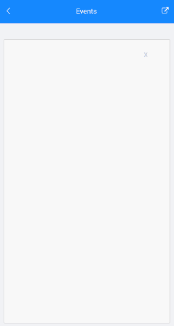

# Events

The SignaturePad for Xamarin exposes the following events: 

* `StrokeStarted` event is raised when a new stroke is started. The `StrokeStarted` event handler receives two parameters: 
	* The `Sender` which is of type `Telerik.XamarinForms.Input.SignatureView`. 
	* and `EventArgs` 

* `StrokeCompleted` event is raised when a new stroke is completed. The `StrokeCompleted` event handler receives two parameters:
	* The `Sender` which is of type `Telerik.XamarinForms.Input.SignatureView`.
	* and `EventArgs` 

* `Cleared` event is raised when the surface of Telerik.XamarinForms.Input.RadSignaturePad is cleared

## Example

1. The example contains a **X** Button, two Labels and a SignaturePad. The control's definition in XAML:

 <snippet id='signaturepad-events'/>

1. Add the following namespace:

 <snippet id='xmlns-telerikinput'/>

Let's add the events:

The `SignaturePad.StrokeStarted` event. When stroke starts we will display a timestamp using a Label:

<snippet id='signaturepad-strokestarted-event'/>

The `SignaturePad.StrokeCompleted` event. When stroke completes the timespamp Label text is udated.

<snippet id='signaturepad-strokecompleted-event'/>

The `SignaturePad.Cleared` event, When `Cleared` event is fired, Label with `Text="Cleared"` is displayed.

<snippet id='signaturepad-cleared-event'/>

## See Also

- [Configure the Signature]()
- [Commands]()
- [Save Signature]()