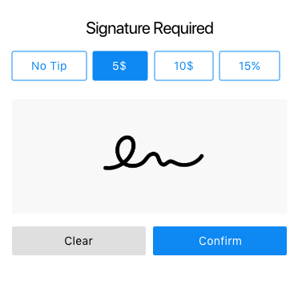

# Overview

**Telerik UI for Xamarin SignaturePad** control gives you the option to display a signature in your desktop and mobile applications, and fully customize its stroke and color. In addition you can easily save the signature in png or jpeg with additional saving settings thanks to the flexible API.  

## Key Featrues

* **Display signature** in your mobile and desktop application.

* [Configure the stroke thickness and color of the signature]() to achieve the exact look and feel.
 
* [Save the signature as an image]() in different formats (**Png** or **Jpeg**). In addition the Saving API allows you to set the image's quality and scale factor. Also you have the option to change the stroke color and thickness of the signature when saving it as an image.

* [Exhaustive numbers of events]() that are raised when a new stroke is started, completed and an event for clearing the surface.  

* [Commands Support](): Easily Save the signature as am image using the exposed command. 

## See Also

- [Getting Started with SignaturePad for Xamarin]()