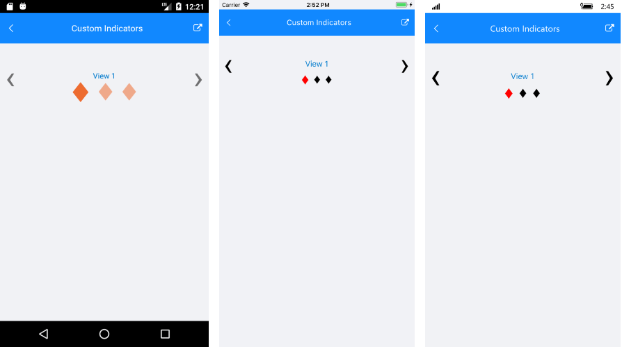

# Customize the Control

**RadSlideView** has several properties which you can use to customize its appearance and behavior. This article lists them briefly.

### Customizing the indicators

The indicators are the little ellipses displayed under the selected view used for switching between the views. RadSlideView provides various options for customzing the look of the indicators via the following properties:

- **ShowIndicators**: This property sets the visibility of the indicators. You can hide them by setting it to False.

- **IndicatorText**: Indicators are represents by a string symbol that could be changed through IndicatorText property;

- **IndicatorFontSize**: Defines the indicator text font size of all indicators except the selected one;

- **SelectedIndicatorFontSize**: Sets the indicator text font size of the selected indicator;

- **IndicatorFontFamily**: Specified the indicator text FontFamily of the indicators except the selected one;

- **SelectedIndicatorFontFamily**: Sets the indicator text FontFamily of the selected indicator;

- **IndicatorColor**: This property sets the color of the indicators except the selected one.

- **SelectedIndicatorColor**: This property sets the color of the selected indicator.

- **IndicatorsSpacing**: This property sets the spacing between the indicators.

Here is a quick example on how to customize the indicators:

<snippet id='slideview-custom-indicators-xaml' />

And the result:

### Customizing the slide buttons

The slide buttons can be customized via the following properties:

- **ShowButtons**: This property sets the buttons visibility. You can hide them by setting it to False.

- **SlideButtonsColor**: This property sets the buttons color.

- **SlideButtonsSize**: This property sets the buttons size.

### Customizing the content alignment

You can set the alignment of the content of the SlideView item via the following properties:

- **HorizontalContentOptions**: This property sets the horizonal alignment

- **VerticalContentOptions**: This property sets the vertical alignment. 

>important HorizontalContentOptions and VerticalContentOptions are respected only when there isn't ContentView or Template defined. In other cases, you would need to handle the content alignment inside the View/Template respectively.

### Disabling the animation

The control supports a built-in sliding animation which is enabled by default. To disable it you can set the control's **IsAnimated** property to False.

### Disabling swiping

You can disable the swiping and allow the end user to change the view only with the slide buttons. To do this set the **IsSwipingEnabled** property to False.

### Enabling infinity scrolling

By default when you reach to the last view, the 'next' slide button won't do anything. You can alter this and allow repeating of the views when you reach the last view, via the **IsInfiniteScrollingEnabled** property.

### Setting orientation

You change the orientation of the slide animation via the **Orientation** property of RadSlideView.

### See Also
- [Getting Started]()
- [ItemTemplate]()
