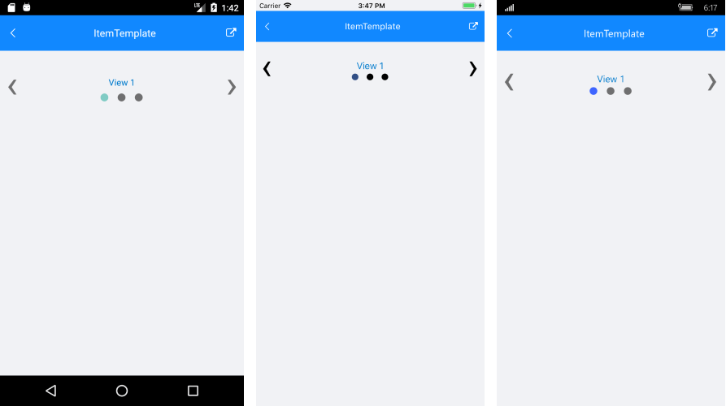

# ItemTemplate

RadSlideView can be populated with various types of objects (string, int, any business objects, etc.). You can customize the visualization of the views in the ItemsSource of the control using its **ItemTemplate** property. The template could contain any view that you can use to display the data.

Additionally, you can select different visualization for each item via the **ItemTemplateSelector** property.

### Еxample

The following example shows how to populate the ItemsSource with business items and customize their appearance.

First, create a sample MyItem class and a ViewModel containing a collection of MyItem objects:

<snippet id='slideview-itemtemplate-businessobject' />

<snippet id='slideview-itemtemplate-viewmodel' />

Then, add the SlideView definition with a sample ItemTemplate applied:

<snippet id='slideview-itemtemplate-xaml' />

All that is left is to set the BindingContext to the ViewModel:

<snippet id='slideview-itemtemplate-setviewmodel' />

Here is the result:
	
#### Figure 1: RadSlideView with ItemTemplate applied

### See Also

- [Project Wizard]()
- [Getting Started]()

