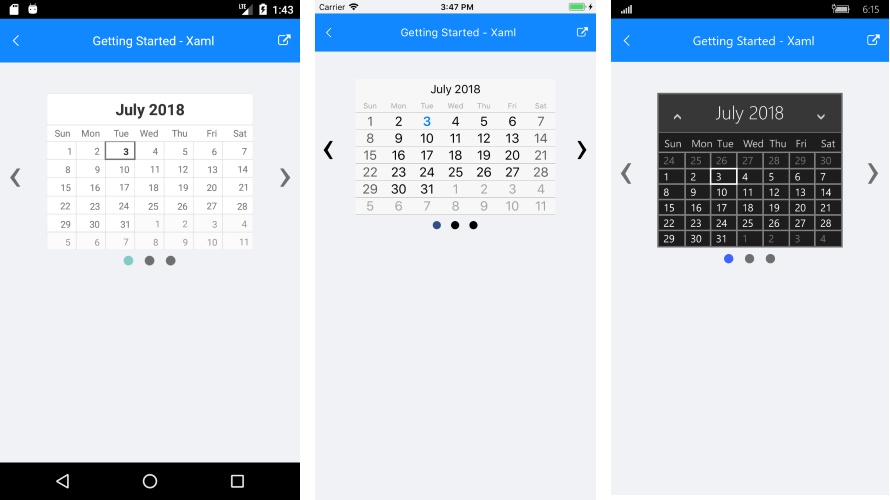

# Getting Started

This article will guide you through the steps needed to add a basic **RadSlideView** control in your application.

* [Setting up the app](#1-setting-up-the-app)
* [Adding the required Telerik references](#2-adding-the-required-telerik-references)
* [Adding RadSlideView control](#3-adding-radslideview-control)
* [Populating RadSlideView with data](#4-populating-radslideview-with-data)

## 1. Setting up the app

Take a look at these articles and follow the instructions to setup your app:

- [Setup app with Telerik UI for Xamarin on Windows]()
- [Setup app with Telerik UI for Xamarin on Mac]()

## 2. Adding the required Telerik references

You have two options:

* Add the Telerik UI for Xamarin Nuget packages following the instructions in [Telerik NuGet package server]() topic.

* Add the references to Telerik assemblies manually, check the list below with the required assemblies for **RadSlideView** component:

| Platform | Assemblies |
| -------- | ---------- |
| Portable | Telerik.XamarinForms.Common.dll<br/>Telerik.XamarinForms.Primitives.dll |
| Android  | Telerik.Xamarin.Android.Common.dll<br/>Telerik.Xamarin.Android.Primitives.dll<br/>Telerik.XamarinForms.Common.dll<br/>Telerik.XamarinForms.Primitives.dll |
| iOS      | Telerik.Xamarin.iOS.dll<br/>Telerik.XamarinForms.Common.dll<br/>Telerik.XamarinForms.Primitives.dll |
| UWP      | Telerik.Core.dll<br/>Telerik.UI.Xaml.Primitives.UWP.dll<br/>Telerik.XamarinForms.Common.dll<br/>Telerik.XamarinForms.Primitives.dll|

## 3. Adding RadSlideView control

You could use one of the following approaches:

#### Drag the control from the Toolbox. 

Take a look at the following topics on how to use the toolbox:

* [Telerik UI for Xamarin Toolbox on Windows]()
* [Telerik UI for Xamarin Toolbox on Mac]()
	
#### Create the control definition in XAML or C#.

The snippet below shows a simple RadSlideView definition:

```XAML
<telerikPrimitives:RadSlideView x:Name="slideView" />
```
```C#
var listView = new SlideView();
```

In addition to this, you need to add the following namespace:

<snippet id='xmlns-telerikprimitives'/>
<snippet id='ns-telerikprimitives'/>

## 4. Populating RadSlideView with data

RadSlideView is populated via its **ItemsSource** property. The control will display an indicator for each item in the ItemsSource and display the view of the selected item.

The next snippet shows how you could set the control's ItemsSource property and populate it with some data.

<snippet id='slideview-getting-started-xaml' />

#### __Figure 1: RadSlideView example__  


Check the [ItemTemplate]() article to see how to populate the control with business items and customize their appearance.

>important **SDK Browser** and **QSF** applications contain different examples that show RadSlideViews's main features. You can find the applications in the **Examples** and **QSF** folders of your local **Telerik UI for Xamarin** installation.

## See Also
- [Customize the control]()
- [ItemTemplate]()
- [Commands]()