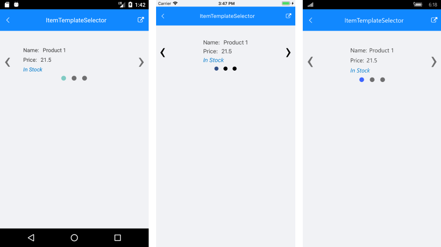
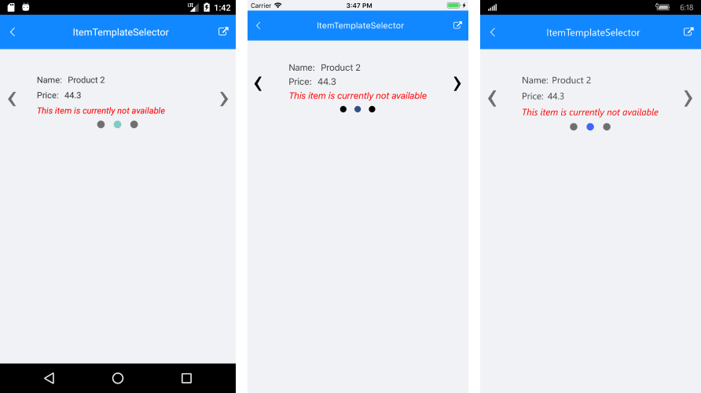

# ItemTemplateSelector

**RadSlideView** control exposes an **ItemTemplateSelector** property which you can use to apply different template to each item depending on a specific condition.

This article will show you how you can utilize this property to achieve divergent appearance for the different items within your Telerik SlideView control. 

## TemplateSelector Implementation

Let's assume you have a RadSlideView bound to a collection of multiple Product objects and the appearance of each item depends on a specific property of the business object. Below is the Product class definition and a sample ViewModel class:

<snippet id='slideview-itemtemplateselector-businessobject' />

<snippet id='slideview-itemtemplateselector-viewmodel' />

Then, as you need to apply different template to the item based on the value of the **InStock** property, you have to create a custom class that inherits from **DataTemplateSelector**. This class will return different **DataTemplate** according to whether the value is true or false:

<snippet id='slideview-itemtemplateselector-selectordefinition' />

The next step is to define the needed templates inside the Resources of your page:

<snippet id='slideview-itemtemplateselector-resources' />

Declare a simple SlideView and set its ItemsSource and ItemTemplateSelector properties:

<snippet id='slideview-itemtemplateselector-xaml' />

All that is left is to set the BindingContext to the ViewModel:

<snippet id='slideview-itemtemplateselector-setviewmodel' />

Here is how RadSlideView looks with both templates applied:

#### Figure 1: RadSlideView with InStockTemplate applied

#### Figure 2: RadSlideView with NotAvailableTemplate applied

### See Also

- [Customize the Control]()
- [ItemTemplate]()

