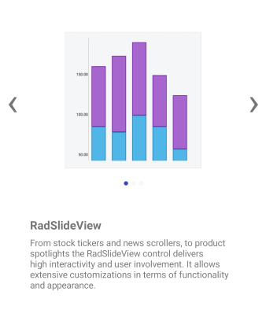

# Overview

**RadSlideView** is a flexible navigation control that allows you to slide between different views, thus providing an interactive navigation. With it you can build a gallery display to show your images and content efficiently.

  

## Key features

* **Customizable indicators and slide buttons**: RadSlideView provides you with the ability to customize the appearance of the indicators and the slide buttons. For more details check [Customize the Control]() topic.

* **Item Template**: You can define an ItemTemplate to present the data in the views in a way that’s most suitable for your scenario. For more details read the [Item Template]() topic.

* **Infinity scrolling**: The control allows you to start repeating the views when you reach the last item in the collection. This is controlled through the [IsInfiniteScrollingEnabled](#enabling-infinity-scrolling) property.

* **Built-in animation**: RadSlideView has a built-in sliding animation which can be enabled or disabled through the [IsAnimated](#disabling-the-animation) property.

* **Commands**: RadSlideView allows you to attach commands that will be executed when the slide actions occur. For more details on this go to the [Commands]() topic.

* **UI Virtualization**: RadSlideView supports UI Virtualization which processes only these visual elements that are loaded in the selected view as well as the previous and the next one. This speeds up the loading time, thus enhancing the UI performance. 

>tip Check out RadSlideView [Getting Started]() help article that shows how to use it in a basic scenario.

## See Also

- [Customize the Control]()
- [Item Template]()
- [Commands]()

