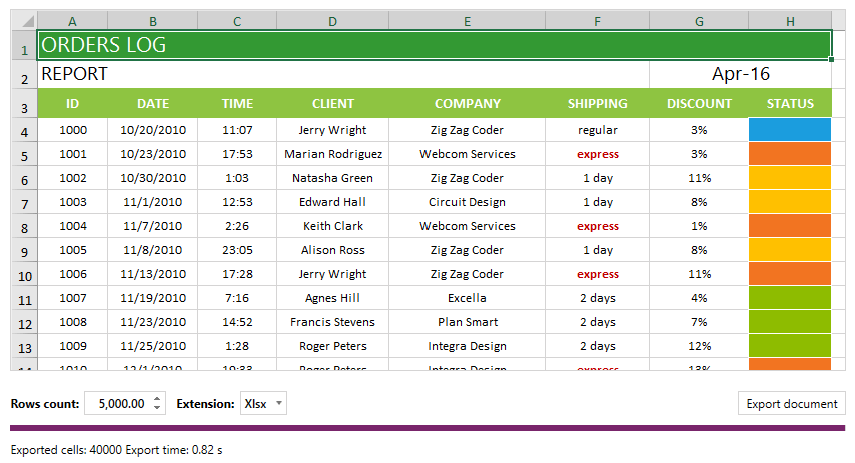

# Overview

Thank you for choosing Telerik **RadSpreadStreamProcessing**!

This article briefly explains the specifics of **RadSpreadStreamProcessing** - what is spread streaming, how it works compared to other libraries and when to use it.

>**RadSpreadStreamProcessing** is part of the **Telerik Document Processing** libraries. The full documentation for this component is available at [http://docs.telerik.com/devtools/document-processing/libraries/radspreadstreamsprocessing](http://docs.telerik.com/devtools/document-processing/libraries/radspreadstreamprocessing/getting-started).

## What is Spread Streaming?

Spread streaming is a document processing paradigm that allows you to create big spreadsheet documents with great performance and minimal memory footprint. 

The key for the memory efficiency is that the spread streaming library writes the spreadsheet content directly to a stream without creating and preserving the spreadsheet document model in memory. Each time an exporter object is disposed, the set values are written into the stream. This allows you to create large documents with an excellent performance.

## Key Features

Some of the features you can take advantage of are:

* Export to XLSX or CSV files
* Writing directly into a stream
* Grouping
* [Styling](http://docs.telerik.com/devtools/document-processing/libraries/radspreadstreamprocessing/features/cell-styles) and [formatting cells](http://docs.telerik.com/devtools/document-processing/libraries/radspreadstreamprocessing/model/cells#set-a-format)
* Hidden [rows](http://docs.telerik.com/devtools/document-processing/libraries/radspreadstreamprocessing/model/row) and [columns](http://docs.telerik.com/devtools/document-processing/libraries/radspreadstreamprocessing/model/column)
* [Freezing panes](http://docs.telerik.com/devtools/document-processing/libraries/radspreadstreamprocessing/features/worksheet-view-exporter#freeze-panes)

## When to Use RadSpreadStreamProcessing

You can use RadSpreadStreamProcessing to create and export large amount of data with a low memory footprint and great performance. 

# Required references

In order to use the __RadSpreadStreamProcessing__ you have to add references to the following assemblies:

- **Telerik.Zip.dll**
- **Telerik.Documents.SpreadsheetStreaming.dll**

