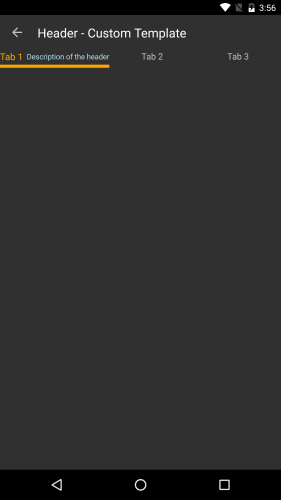
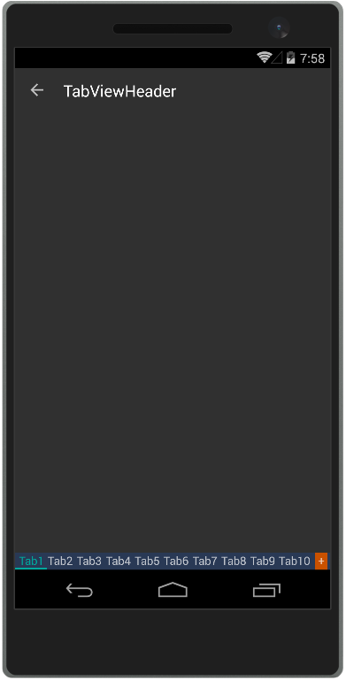

# TabViewHeader

The tab strip area of RadTabView is visualized via the **TabViewHeader** element. You can use the **Header** property of **RadTabView** to set a custom header.

## Setting the Header's Position

You can use the **HeaderPosition** property of RadTabView to control the position of the header. The property allows you to place the header at the **top** of the control where is by default or at the **bottom**, under the content of the selected tab.

<snippet id='tabview-features-header-position'/>

## TabViewHeader Custom Template

You can further customize the appearance of each **TabViewItem** header by modifying the template of the **TabViewHeaderItem**. Below you can find a sample scenario where a custom control template is declared and set to the **ControlTemplate** property of the **TabViewHeaderItem**. You can use this approach to control the color of the selected header as well.

### Example 
<snippet id='tabview-features-tabviewheader-custom-template-xaml'/>

#### **Figure 1: TabViewHeaderItem with Custom Control Template**

## Customizing the overflow button

If there are too many items in the tabview control and they cannot fit into the tab strip area, an overflow button will be displayed. You can customize the button through the following properties.

- **OverflowButtonText**: You can use this property to set the text of the button. The default one is "More".
- **OverflowButtonTemplate**: If you need more complex layout for the button you can use this property.

### Example

This example demonstrates how to replace the default header of the RadTabView control and change its background. Also, how to set the header position to display the tab strip area at bottom.

<snippet id='tabview-features-tabviewitem-xaml'/>
<snippet id='tabview-features-tabviewitem-csharp'/>

Additionally, you can work with the already assigned header instead of replacing it with a new one. For example - `tabView.Header.BackgroundColor = Color.Green`. 

#### __Figure 2: Custom TabViewHeader example__  

### See Also

- [Getting Started]()
- [TabViewItem]()
