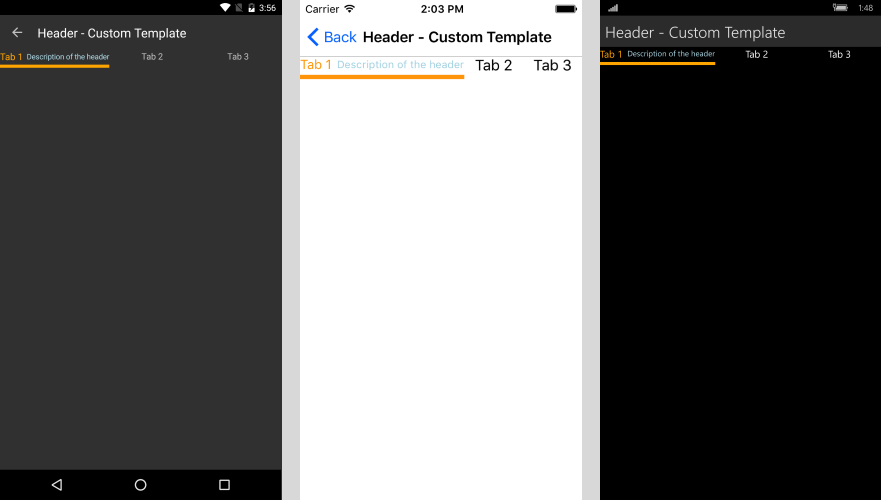
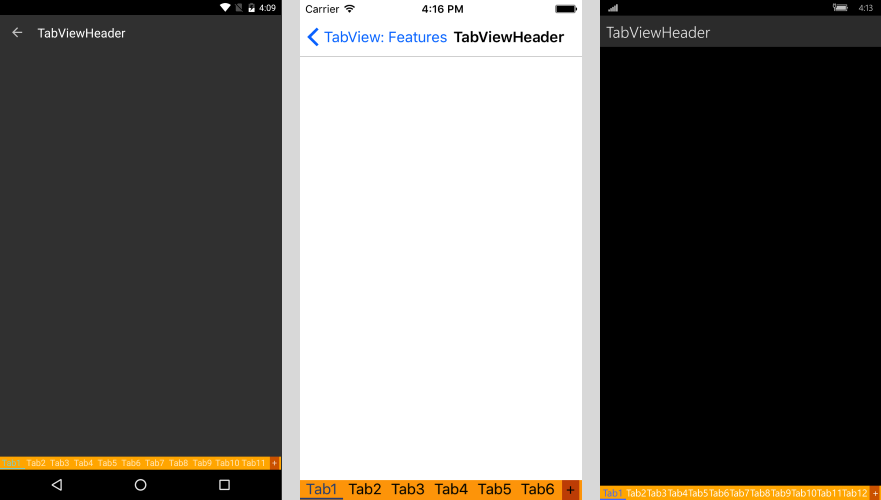

# TabViewHeaderItem

The tab strip area of RadTabView contains a special toolbar panel that hosts all **TabViewHeaderItem** elements. The **RadTabView** control exposes a **Header** property which you can use to modify the header's appearance. Each individual **TabViewItem** has a **Header** property as well so you can set a specific **TabViewHeaderItem** for each individual tab.

## Setting the Header's Position

You can use the **HeaderPosition** property of RadTabView to control the position of the header. The property allows you to place the header at the **top** of the control where is by default or at the **bottom**, under the content of the selected tab. 

## Custom TabViewHeader 

You can customize the appearance of each **TabViewHeaderItem** by replacing its default template with one of your choice. Below you can find a sample scenario where a custom control template is declared and set to the **ControlTemplate** property of the **TabViewHeaderItem**. 

>tip You can alter the control template of the **TabViewHeaderItem** in order to control the color of the selected item. 

### Example 
<snippet id='tabview-features-tabviewheader-custom-template-xaml'/>

#### **Figure 1: TabViewHeaderItem with custom Control Template**

## Customizing the Overflow Button

If there are too many items in the tabview control and they cannot fit into the tab strip area, an overflow button will be displayed. You can customize the button through the following properties.

- **OverflowButtonText**: You can use this property to set the text of the button. The default one is "More".
- **OverflowButtonTemplate**: If you need more complex layout for the button you can use this property.

### Example

This example demonstrates how to replace the default header of the RadTabView control and change its background. Also, how to set the header position to display the tab strip area at bottom.

<snippet id='tabview-features-tabviewitem-xaml'/>
<snippet id='tabview-features-tabviewitem-csharp'/>

Additionally, you can work with the already assigned header instead of replacing it with a new one. For example - `tabView.Header.BackgroundColor = Color.Green`. 

#### __Figure 2: Custom TabViewHeader example__  

### See Also

- [Getting Started]()
- [TabViewItem]()
