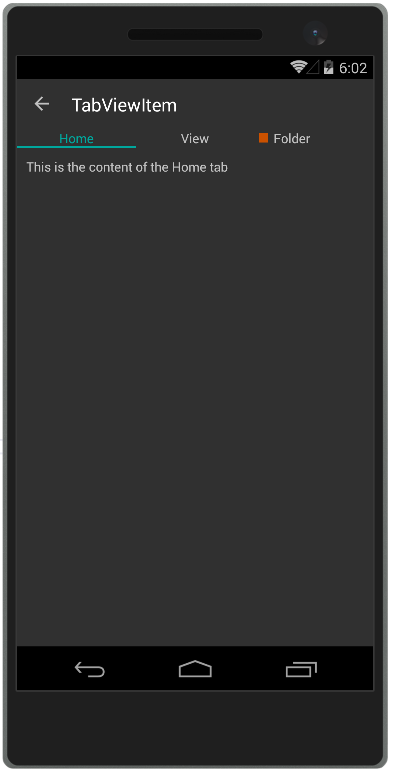

# TabViewItem

**TabViewItem** is the control used to populate **RadTabView**. It displays the header of the tab item and the corresponding content.

## Displaying TabViewItem

To display a TabViewItem you can add it in the **Items** collection of **RadTabView**.

## Defining Header

You can define a header for TabViewItem using its **Header** or **HeaderText** properties. HeaderText can be used to set a simple string header. On the other hand the **Header** allows you to create a more **complex layout** for the tabview using the **TabViewHeaderItem** control. You can see both properties demonstrated in the [Example](#example) section of this article.

## Defining Content

You can define the content of a TabViewItem via its **Content** property. It is of type View, so you can use any UI element that implements the View class.

> The RadTabView control will display only the content of the selected item.

## Selecting an Item

You can manually select TabViewItem via its **IsSelected** bool property. Selecting an item will deselect all the others from the Items collection. See also the [Selection]() article.

## Example

This example demonstrates how to define RadTabView with TabViewItems and set their header, content and also how to select an item via its **IsSelected** property. 

<snippet id='tabview-features-tabviewitem-xaml'/>
<snippet id='tabview-features-tabviewitem-csharp'/>

#### __Figure 1: TabViewItem example__  

## See Also

- [Getting Started]()
- [Selection]()
