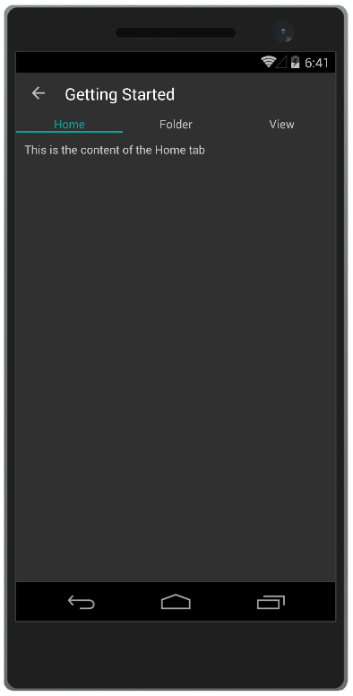

# Getting Started

This article demonstrates how to create a sample application that contains **RadTabView**.

>Before you proceed, please, take a look at these articles and follow the instructions to setup your app:
>- [Setup on Windows]()
>- [Setup on Mac]()
>- [Required Telerik Assemblies]()

### Defining RadTabView

To use the tabview control you can include the following namespaces:

<snippet id='xmlns-telerikprimitives'/>
<snippet id='ns-telerikprimitives'/>

To display something in the tab you can define [TabViewItem]({%slug tabview-features-tabviewitem}) elements in its **Items** collection.

<snippet id='tabview-getting-started-xaml'/>
<snippet id='tabview-getting-started-csharp'/>

To define the header of a TabViewItem you can use its **HeaderText** property as in the example. If you need to show a more complext layout you can use the **Header** property.

#### __Figure 1: TabView example__  

### See Also

- [Project Wizard]()
- [Getting Started on Windows]()
- [Getting Started on Mac]()
