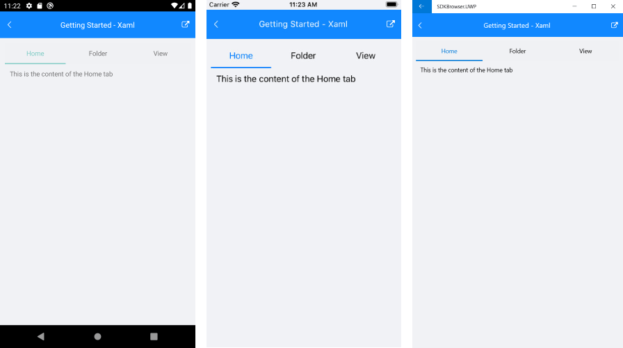

# Getting Started

This article will guide you through the steps needed to add a basic **RadTabView** control in your application.

* [Setting up the app](#1-setting-up-the-app)
* [Adding the required Telerik references](#2-adding-the-required-telerik-references)
* [Adding RadTabView control](#3-adding-radtabview-control)

## 1. Setting up the app

Take a look at these articles and follow the instructions to setup your app:

- [Setup app with Telerik UI for Xamarin on Windows]()
- [Setup app with Telerik UI for Xamarin on Mac]()

## 2. Adding the required Telerik references

You have two options:

* Add the Telerik UI for Xamarin Nuget package following the instructions in [Telerik NuGet package server]() topic.

If you don't want to add the all Telerik.UI.for.Xamarin nuget package, you have the option to add a separate nuget package. For RadTabView control you have to install the **Telerik.UI.for.Xamarin.Primitives** nuget package. This nuget will automatically refer the *Telerik.UI.for.Xamarin.Common* and *Telerik.UI.for.Xamarin.SkiaSharp* nuget packages.

* Add the references to Telerik assemblies manually, check the list below with the required assemblies for **RadTabView** component:

| Platform | Assemblies |
| -------- | ---------- |
| Portable | Telerik.XamarinForms.Common.dll   Telerik.XamarinForms.Primitives.dll |
| Android  | Telerik.XamarinForms.Common.dll   Telerik.XamarinForms.Primitives.dll  Telerik.Xamarin.Android.Common.dll   Telerik.Xamarin.Android.Primitives.dll |
| iOS      | Telerik.XamarinForms.Common.dll   Telerik.XamarinForms.Primitives.dll |
| UWP      | Telerik.XamarinForms.Common.dll   Telerik.XamarinForms.Primitives.dll |

## 3. Adding RadTabView control

You could use one of the following approaches:

#### Drag the control from the Toolbox. 

Take a look at the following topics on how to use the toolbox:

* [Telerik UI for Xamarin Toolbox on Windows]()
* [Telerik UI for Xamarin Toolbox on Mac]()
	
#### Create the control definition in XAML or C#.

The snippet below shows a simple RadTabView definition:

<snippet id='tabview-getting-started-xaml'/>
<snippet id='tabview-getting-started-csharp'/>

In addition to this, you need to add the following namespace:

<snippet id='xmlns-telerikprimitives'/>
<snippet id='ns-telerikprimitives'/>

To display something in the tab you can define [TabViewItem]() elements in its **Items** collection.

To define the header of a TabViewItem you can use its **HeaderText** property as in the example. If you need to show a more complex layout you can use the **Header** property.

This is the result:
 

>important **SDK Browser** and **QSF** applications contain different examples that show RadTabView's main features. You can find the applications in the **Examples** and **QSF** folders of your local **Telerik UI for Xamarin** installation.

## See Also

- [Key Features]()
- [TabViewItem]()
- [TabViewHeaderItem]()
