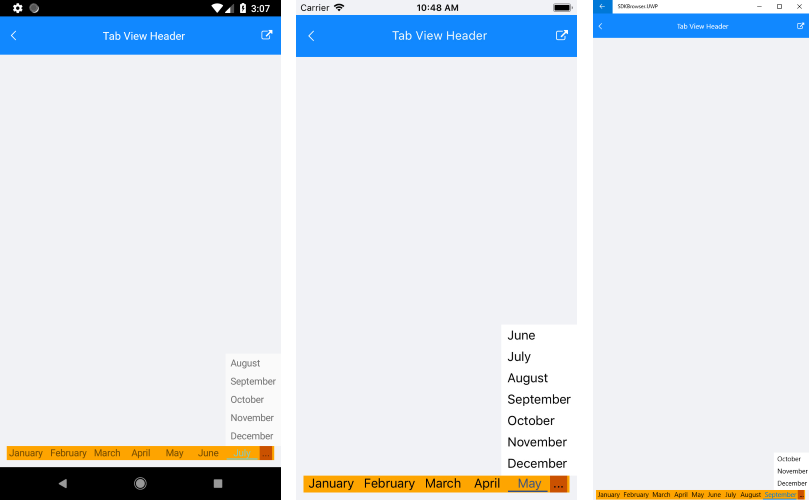

# TabViewHeaderItem

The tab strip area of RadTabView contains a special toolbar panel that hosts all **TabViewHeaderItem** elements. Each individual **TabViewItem** has a **Header** property as well so you can set a specific **TabViewHeaderItem** for each tab.

## Setting the Header's Position

You can use the **HeaderPosition** property of RadTabView to control the position of the header. The property allows you to place the header at the **Top** of the control where is by default or at the **Bottom**, under the content of the selected tab. 

## Default TabViewHeaderItem ControlTemplate

Here is the default Header ControlTemplate definition:

```XAML
<ControlTemplate x:Key="HeaderControlTemplate" >
    <Grid BackgroundColor="Transparent">
        <BoxView IsVisible="{TemplateBinding IsSelected}"
                    BackgroundColor="{TemplateBinding SelectedColor}"
                    VerticalOptions="End"
                    HeightRequest="2" />
        <Label Text="{TemplateBinding Text}" 
                Margin="0, 0, 0, 2" 
                VerticalOptions="Center" 
                HorizontalOptions="Center" />
    </Grid>
</ControlTemplate>
```

The TabView definition and how to control template is set to the TabView Header

```XAML
<telerikPrimitives:RadTabView x:Name="tabView"
                              HeaderPosition="Top">
    <telerikPrimitives:RadTabView.Items>
        <telerikPrimitives:TabViewItem>
            <telerikPrimitives:TabViewItem.Header>
                <telerikPrimitives:TabViewHeaderItem Text="Tab 1" 
                                                     ControlTemplate="{StaticResource HeaderControlTemplate}" />
            </telerikPrimitives:TabViewItem.Header>
        </telerikPrimitives:TabViewItem>
        <telerikPrimitives:TabViewItem HeaderText="Tab 2"/>
        <telerikPrimitives:TabViewItem HeaderText="Tab 3"/>
    </telerikPrimitives:RadTabView.Items>
</telerikPrimitives:RadTabView>
```

## Customize the TabViewHeaderItem Control Template: 

You can customize the appearance of each **TabViewHeaderItem** by replacing its default template with one of your choice. Below you can find a sample scenario where a custom control template is declared and set to the **ControlTemplate** property of the **TabViewHeaderItem**. 

>tip You can alter the control template of the **TabViewHeaderItem** in order to control the color of the selected item. 

### Example 

<snippet id='tabview-features-tabviewheader-custom-template-xaml'/>

Here is the result how the TabViewHeaderItem with custom Control Template looks:


>important A sample HeaderItem Custom Template example can be found in the TabView/Features folder of the [SDK Samples Browser application]().


## TabView Header

The **RadTabView** control exposes a **Header**(*TelerikXamarinForms.Primitives.TabViewHeader*) property which you can use to modify the header's appearance.

The `TabViewHeader` allows you to style and customize the OverflowButton. In addition you can decide whetehr scrolling inside the tabs will be allowed using the `IsScrollanle` `bool` property. When `IsScrollable` is `True`, OverflowButton won't be visualized, instead you can scroll through the tabs.

### OverflowButton styling

Example how to set styling to OverflowButton

```XAML
<telerikPrimitives:RadTabView x:Name="tabViewHeaderOverfowButton" HeaderPosition="Bottom">
    <telerikPrimitives:RadTabView.Header>
        <telerikPrimitives:TabViewHeader BackgroundColor="LightBlue" 
                                         OverflowButtonContentPadding="3" 
                                         OverflowButtonFontSize="20"
                                         OverflowButtonText="More items"
                                         OverflowButtonTextColor="Black"
                                         OverflowPopupBackgroundColor="LightBlue"/>
    </telerikPrimitives:RadTabView.Header>
</telerikPrimitives:RadTabView>
```

### Scrolling Tabs

Here is how to set `IsScrollable`

```XAML
<telerikPrimitives:RadTabView x:Name="tabViewHeader" HeaderPosition="Top">
    <telerikPrimitives:RadTabView.Header>
        <telerikPrimitives:TabViewHeader BackgroundColor="Orange" IsScrollable="True"/>
    </telerikPrimitives:RadTabView.Header>
</telerikPrimitives:RadTabView>
```

### Adjust the width between the tab view headers

By default there is a spacing between the tab view headers. The behavior comes from the RadToolbar control which is used for the TabView headers.
In order to adjust the width between the tabview headers you will need to set the `ItemSpacing` property (of type `double`) to the `RadTabView.Header`


```XAML
<telerikPrimitives:RadTabView x:Name="tabView"
                            HeaderPosition="Top">
    <telerikPrimitives:RadTabView.Header>
        <telerikPrimitives:TabViewHeader ItemSpacing="0"/>
    </telerikPrimitives:RadTabView.Header>
</telerikPrimitives:RadTabView>
```

### Customizing the Overflow Button

If there are too many items in the tabview control and they cannot fit into the tab strip area, an overflow button will be displayed. You can customize the button through the following properties.

- **OverflowButtonText**: You can use this property to set the text of the button. The default one is "More".
- **OverflowButtonTemplate**: If you need more complex layout for the button you can use this property.

### Example

This example demonstrates how to replace the default header of the RadTabView control and change its background. Also, how to set the header position to display the tab strip area at bottom.

<snippet id='tabview-features-tabviewheader-overflowbutton-xaml'/>
<snippet id='tabview-features-tabviewheader-csharp'/>

Additionally, you can work with the already assigned header instead of replacing it with a new one. For example - `tabView.Header.BackgroundColor = Color.Green`. 

Here is how the overflow button looks after customization:  



>important A sample Overflow Button Customization example can be found in the TabView/Features folder - Tab View Header of the [SDK Samples Browser application]().

### See Also

- [TabViewItem]()
