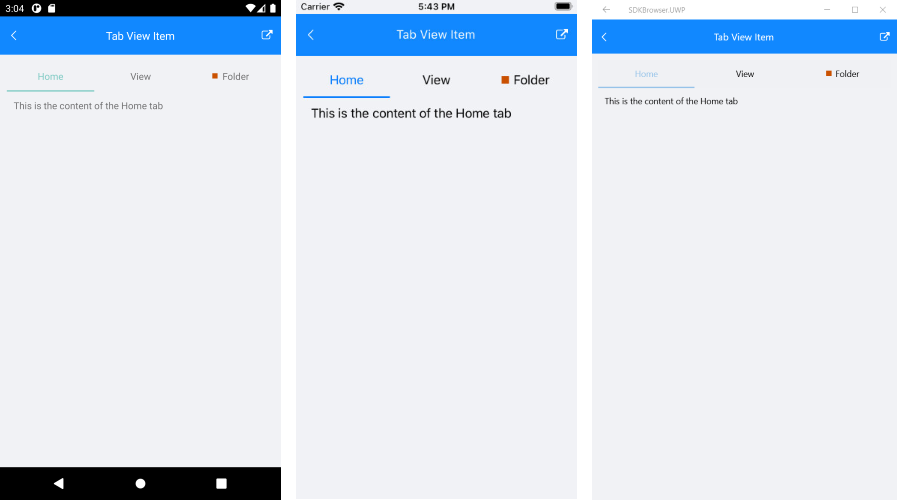

# TabViewItem

**TabViewItem** is the control used to populate **RadTabView**. It displays the header of the tab item and the corresponding content.

## Displaying TabViewItem

To display a TabViewItem you can add it in the **Items** collection of **RadTabView**.

## Defining Header

You can define a header for TabViewItem using one of the following properties:

* **HeaderText**: Defines a simple string header. 
* **Header**: allows you to create a more **complex layout** for the TabView using the **TabViewHeaderItem** control. 

You can see both properties demonstrated in the [Example](#example) section of this article.

## Defining Content

You can define the content of a TabViewItem via its **Content** property. It is of type *View*, so you can use any UI element that implements the View class.

> The RadTabView control will display only the content of the selected item.

## Selecting an Item

You can manually select TabViewItem via its **IsSelected** *bool* property. Selecting an item will deselect all the others from the Items collection. For more details on selection check the [Key Features]() article.

## Example

This example demonstrates how to define RadTabView with TabViewItems and set their header, content and also how to select an item via its **IsSelected** property. 

<snippet id='tabview-features-tabviewitem-xaml'/>
<snippet id='tabview-features-tabviewitem-csharp'/>

Here is the result:
 

## See Also

- [TabViewHeaderItem]()
