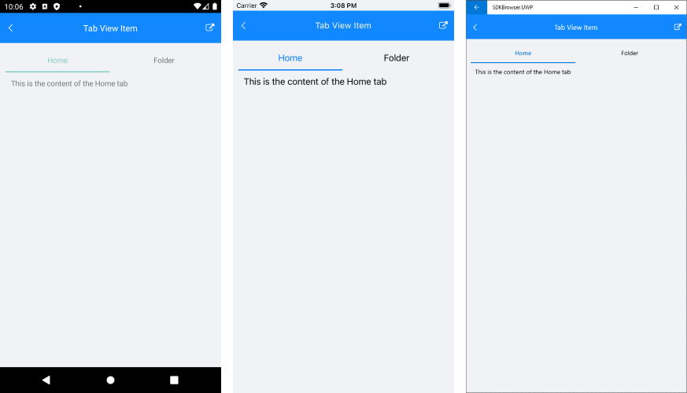

# TabViewItem

**TabViewItem** is the control used to populate **RadTabView**. It displays the header of the tab item and the corresponding content. TabView Item exposes the following properties:

* **HeaderText**(*string*): Defines a simple text for the TabView header.
* **Header**(*Telerik.XamarinForms.Primitives.TabViewHeaderItem*): Allows you to create a more **complex layout** for the TabView Header using the **TabViewHeaderItem** control.
* **Content**(*Xamarin.Forms.View*): Defines the content of the TabView Item
* **IsSelected**(*bool*): Defines the selected TabView item.
* **IsEnabled**(*bool*): Defines whether the TabView Item is enabled/disabled. By default `IsEnabled` is `True`.
* **IsVisible**(*bool*): Specified whether the TabView Item is visible/hidden. **IsVisible** is supported only with the TabView `IsContentPreserved` property set to `False`.

>important TabViewItem **IsVisible** is supported only in scenarios where "IsContentPreserved" property of the TabView is **False**. If you try to hide an item (set "IsVisible" to **False**) when "IsContentPreserved" is enabled, an **InvalidOperationException** will be raised.


## Displaying TabViewItem

To display a TabViewItem you can add it in the **Items** collection of **RadTabView**.

### Example

```XAML
<telerikPrimitives:RadTabView x:Name="tabView" HeaderPosition="Bottom">
    <telerikPrimitives:RadTabView.Items>
        <telerikPrimitives:TabViewItem HeaderText="Tab1 " />
        <telerikPrimitives:TabViewItem HeaderText="Tab2 " />
        <telerikPrimitives:TabViewItem HeaderText="Tab3 " />
    </telerikPrimitives:RadTabView.Items>
</telerikPrimitives:RadTabView>
```

## Defining Header

You can define a header for TabViewItem using one of the following properties:

* **HeaderText**: Defines a simple text for the TabView header. 
* **Header**: Allows you to create a more **complex layout** for the TabView using the **TabViewHeaderItem** control. 

### Example with HeaderText and Header

```XAML
<telerikPrimitives:RadTabView>
	<telerikPrimitives:RadTabView.Items>
		<telerikPrimitives:TabViewItem HeaderText="View">
            <telerikPrimitives:TabViewItem.Content>
                <Label Margin="10" Text="This is the content of the View tab" />
            </telerikPrimitives:TabViewItem.Content>
        </telerikPrimitives:TabViewItem>

        <telerikPrimitives:TabViewItem>
            <telerikPrimitives:TabViewItem.Header>
                <telerikPrimitives:TabViewHeaderItem>
                    <telerikPrimitives:TabViewHeaderItem.Content>
                        <StackLayout Orientation="Horizontal" HorizontalOptions="Center">
                            <telerikPrimitives:RadBorder BackgroundColor="#CA5100"
                                                         HeightRequest="10"
                                                         VerticalOptions="Center"
                                                         WidthRequest="10" />
                            <Label Text="Folder" VerticalOptions="Center" />
                        </StackLayout>
                    </telerikPrimitives:TabViewHeaderItem.Content>
                </telerikPrimitives:TabViewHeaderItem>
            </telerikPrimitives:TabViewItem.Header>
            <telerikPrimitives:TabViewItem.Content>
                <Label Margin="10" Text="This is the content of the Folder tab" />
            </telerikPrimitives:TabViewItem.Content>
        </telerikPrimitives:TabViewItem>

    </telerikPrimitives:RadTabView.Items>
</telerikPrimitives:RadTabView>
```

> You can see both properties demonstrated in the [Example](#example) section of this article.

## Defining Content

You can define the content of a TabViewItem via its `Content` property. It is of type `View`, so you can use any UI element that implements the View class.

### Example

```XAML
<telerikPrimitives:RadTabView x:Name="tabView">
	<telerikPrimitives:RadTabView.Items>
	
	    <telerikPrimitives:TabViewItem HeaderText="Home">
	        <telerikPrimitives:TabViewItem.Content>
	            <Label Margin="10" Text="This is the content of the Home tab" />
	        </telerikPrimitives:TabViewItem.Content>
	    </telerikPrimitives:TabViewItem>
	
	    <telerikPrimitives:TabViewItem HeaderText="View">
	        <telerikPrimitives:TabViewItem.Content>
	            <Label Margin="10" Text="This is the content of the View tab" />
	        </telerikPrimitives:TabViewItem.Content>
	    </telerikPrimitives:TabViewItem>
	</telerikPrimitives:RadTabView.Items>
</telerikPrimitives:RadTabView>
```

> The RadTabView control displays only the content of the selected item.

## Selecting an Item

You can manually select TabViewItem via its `IsSelected` `bool` property. Selecting an item will deselect all the others from the Items collection. For more details on selection check the [Key Features]() article.

## Disabled Tabs

With Telerik UI for Xamarin version 2020.3.1106.1 TabView Item has a support for Disabled tabs. You can set the `IsEnabled` `bool` property of the TadViewItem to `False` if you want to prevent the header to be clicked. The header text will look disabled and you can not click on it.

```XAML
<telerikPrimitives:RadTabView x:Name="tabView">
	<telerikPrimitives:RadTabView.Items>
	
	    <telerikPrimitives:TabViewItem HeaderText="Home" IsEnabled="False">
	        <telerikPrimitives:TabViewItem.Content>
	            <Label Margin="10" Text="This is the content of the Home tab" />
	        </telerikPrimitives:TabViewItem.Content>
	    </telerikPrimitives:TabViewItem>
	
	    <telerikPrimitives:TabViewItem HeaderText="View">
	        <telerikPrimitives:TabViewItem.Content>
	            <Label Margin="10" Text="This is the content of the View tab" />
	        </telerikPrimitives:TabViewItem.Content>
	    </telerikPrimitives:TabViewItem>
	</telerikPrimitives:RadTabView.Items>
</telerikPrimitives:RadTabView>
```

## Hidden Tabs

With Telerik UI for Xamarin R3 2021 TabView introduces `IsVisible` property for the TabViewItem - with it you can easily show/hide certain TabItem without removing it from the TabView Items collection. 

```XAML
<telerikPrimitives:RadTabView x:Name="tabView">
    <telerikPrimitives:RadTabView.Items>

        <telerikPrimitives:TabViewItem HeaderText="Home">
            <telerikPrimitives:TabViewItem.Content>
                <Label Margin="10" Text="This is the content of the Home tab" />
            </telerikPrimitives:TabViewItem.Content>
        </telerikPrimitives:TabViewItem>

        <telerikPrimitives:TabViewItem HeaderText="View" 
									   IsVisible="False">
            <telerikPrimitives:TabViewItem.Content>
                <Label Margin="10" Text="This is the content of the View tab" />
            </telerikPrimitives:TabViewItem.Content>
        </telerikPrimitives:TabViewItem>

        <telerikPrimitives:TabViewItem HeaderText="Folder">
            <telerikPrimitives:TabViewItem.Content>
                <Label Margin="10" Text="This is the content of the Folder tab" />
            </telerikPrimitives:TabViewItem.Content>
        </telerikPrimitives:TabViewItem>

    </telerikPrimitives:RadTabView.Items>
</telerikPrimitives:RadTabView>
```

Check the result below on different platforms:



## Example

This example demonstrates how to define RadTabView with TabViewItems and set their header, content and also how to select an item via its `IsSelected` property. 

<snippet id='tabview-features-tabviewitem-xaml'/>
<snippet id='tabview-features-tabviewitem-csharp'/>

Here is the result:
 


## See Also

- [TabViewHeaderItem]()
