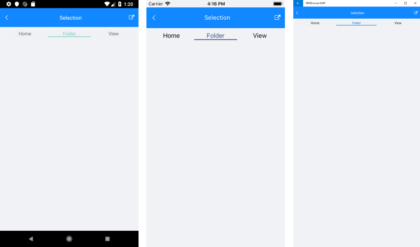

# Key features

**RadTabView** control exposes the following properties:

* **Items**(*ObservableItemCollection<TabViewItem>*)
* **IsContentPreserved**: Specifies whether the state of the content will be preserved when the selection is changed.
* **Header** (*TabViewHeader*): Modify the header appearance.
* The TabView Header position could be easily changed to top/bottom through the **HeaderPosition**(*TabViewHeaderPosition*) property. The default header position is top. 
* **SelectedItem**(*object*)

## TabView Selection

Changing the selection will highlight the corresponding item and show its content under the tab strip area.

The RadTabView control exposes a few useful properties which can help you work with the items selection.

* **SelectedItem** property is used to set up the selection.

>tip TabViewItem can be selected by setting its IsSelected property to *true*.

>important If the item assigned to the SelectedItem property is not added in the Items collection the control, the selection will be lost.

### Example

The snippet below shows how to set the selection manually.

<snippet id='tabview-features-selection-csharp'/>

This is the result:

>important A sample Selection example can be found in the TabView/Features folder of the [SDK Samples Browser application]().

## Customizing the Selected Item

In order to customize the appearance of the selected item, you can modify the control template of the TabViewHeaderItem. More about this check the [TabViewHeader Custom Template](#tabview-header-item-custom-template).

## See Also

- [TabViewItem]()
- [TabView HeaderItem]()
