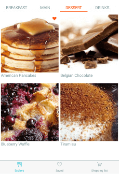

# Overview

**RadTabView** is a flexible navigation control that allows you to build tabbed interfaces. Each tabview item has an associated content displayed on selection.

 

## Key features

* **Item Selection**: RadTabView exposes selection API which allows you as a developer to extend the navigation per application needs. For more details read the [Selection]() topic.
* **Flexible header and content of the items**: You can easily customize the header and the content of the tabview items. Go to the [TabViewItem]() topic for more information on this.
* **Customizable tab strip area position**: The tab strip can be positioned top or bottom. Go to [Setting Header’s position](#setting-the-headers-position) section for more details on this.
* **Layout option for overflow tabs**: If there are too many items in the TabView control and they cannot fit into the tab strip area, a customizable overflow button will be displayed. 

## See Also

- [Getting Started]()
