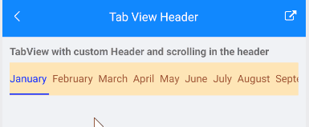

# Scrolling Tabs

With R1 2021 Official release the **RadTabView** control allows you to scroll through the tabs inside the TabView Header.

* **IsHeaderScrollable**(*bool*): Specifies whether the header will allow scrolling. The default value is false. 

Here is the TabView definition with default header and `IsHeaderScrollable` set to `True`:

<snippet id='tabview-features-isheaderscrollable-xaml'/>

This is the result:

>important A sample TabView Header example can be found in the TabView/Features folder of the [SDK Samples Browser application]().

## Scrolling in the header with custom TabView Header

In order to customize the TabView Header you will need to use the RadTabView `Header` property of type `TabViewHeader` . If you want to apply scrolling in the custom header then you should use the `IsScrollable` property of type `bool`. 

### Example:

Here is the TabView definition with custom header and `IsScrollable` set to `True`:

<snippet id='tabview-features-tabviewheader-xaml'/>

This is the result:

>important A sample TabView Header example can be found in the TabView/Features folder of the [SDK Samples Browser application]().

## See Also

- [TabViewItem]()
- [TabView HeaderItem]()
