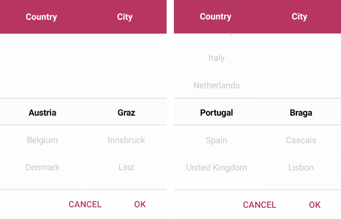

# Overview

**Telerik Templated Picker for Xamarin** is a fully customizable picker control which allows you create a custom picker based on the scenario you want to achieve. You can pick an item from a selector with a custom template. 

## Key features

* **Selector Template**: Custom Picker control allows you to define a template for the items. To learn more about this, visit [Templates]() article.

* **DisplayString Format**: You can choose what text to display when an item from the selector template was picked through the Picker DisplayStringFormat property. For more info on this check the [Key Features - Display String](#displaystringformat) section.

* **Flexible Styling API**:  Take advantage of the styling capabilities of RadTemplated Picker. You can easily style its Spinners, the Popup and its header and footer. For more details check [Styling]() article.

* **Commands Support**: Templated Picker exposes commands that allows you to clear the selected item - Clear Command and Toggle Command which allows you to open and close the dialog. More information about Commands support check our [Commands]() article.

>tip Check out RadTemplated Picker [Getting Started]() help article that shows how to use it in a basic scenario.

## See Also

- [Visual Structure]()
- [Getting Started]()
- [Templates]()
- [Styling]()