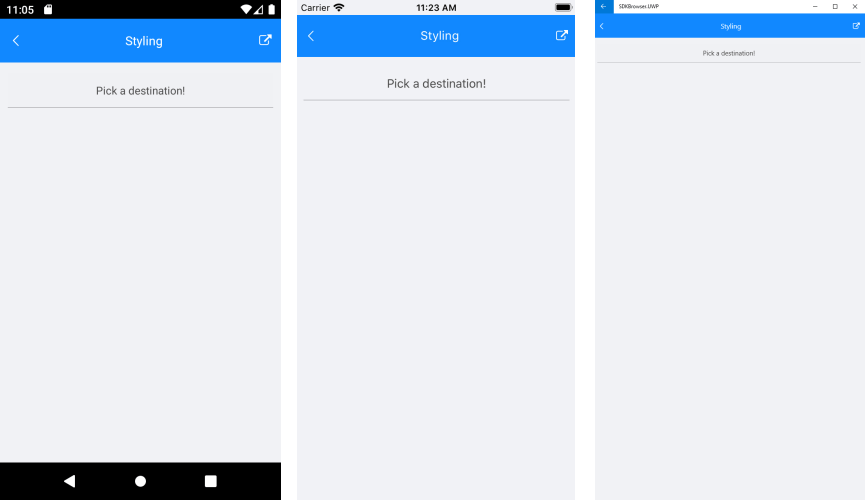
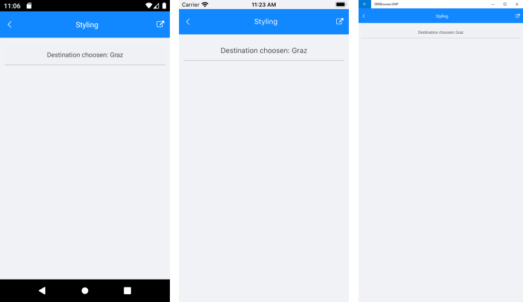
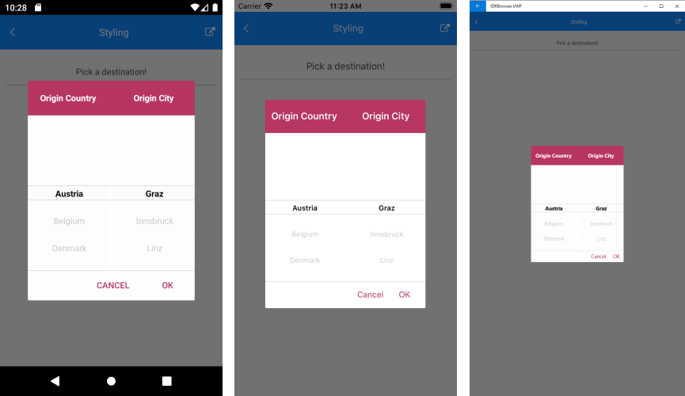

# Styling

* **PlaceholderLabelStyle**(of type *Style* with target type **Label**): Defines the style applied to the placeholder label.
* **DisplayLabelStyle**(of type *Style* with target type **Label**): Defines the style applied to the label which is visualized when item from the selector is picked.

## PlaceholderLabel Style



## DisplayLabel Style



Using the SelectorSettings property of the RadPickerBase class, you could style the dialog(popup) through the following properties:

* **PopupViewStyle**(of type *Style* with target type **telerikInput:PickerPopupContentView**): Defines the popup view style.
* **HeaderStyle**(of type *Style* with target type **telerikInput:PickerPopupHeaderView**): Defines the popup header style.
* **HeaderLabelStyle**(of type *Style* with target type **Label**): Defines the popup header label style.
* **FooterStyle**(of type *Style* with target type **telerikInput:PickerPopupFooterView**): Defines the popup footer style.
* **AcceptButtonStyle**(of type *Style* with target type **Button**): Defines the Accept button style.
* **CancelButtonStyle**(of type *Style* with target type **Button**): Defines the Cancel button style.

The SelectorSetting also provides the following properties for popup customization:

* **PopupOutsideBackgroundColor**(*Xamarin.Forms.Color*): Defines the color outside of the popup.
* **HeaderLabelText**(*string*): Specifies the text visualized in the popup header.
* **AcceptButtonText**(*string*): Defines the text visualized for the accept button. By default the text is *OK*.
* **CancelButtonText**(*string*): Defines the text visualized for the cancel button. By default the text is *Cancel*. 

## Example

Here is a sample example which shows how the styling properties are applied.

A sample Templated Picker definition:

<snippet id='templatedpicker-style' />

and here are how the styles are defined in the page resources

## PlaceholderLabel Style

<snippet id='templatedpicker-placeholderlabelstyle' />

## DisplayLabel Style

<snippet id='templatedpicker-displaylabelstyle' />

## HeaderLabel Style

<snippet id='templatedpicker-headelabelstyle' />

## Footer Style

<snippet id='templatedpicker-commonbuttonstyle' />

## AcceptButton Style

<snippet id='templatedpicker-acceptbuttonstyle' />

## CancelButton Style

<snippet id='templatedpicker-cancelbuttonstyle' />

add the following Business model for the first spinner:

<snippet id='templatedpicker-country-businessmodel' />

add the following Business model for the second spinner:

<snippet id='templatedpicker-city-businessmodel' />

here is a sample definition of the ViewModel:

<snippet id='templatedpicker-viewmodel' />

In addition to this, you need to add the following namespace:

```XAML
xmlns:telerikInput="clr-namespace:Telerik.XamarinForms.Input;assembly=Telerik.XamarinForms.Input"
```

This is how the Templated Picker looks when the SelectorSetting properties are applied:



>important A sample Styling example can be found in the TemplatedPicker/Features folder of the [SDK Samples Browser application]().

## See Also

- [Getting Started]()
- [Templates]()