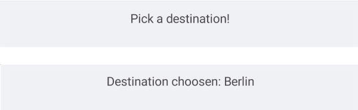
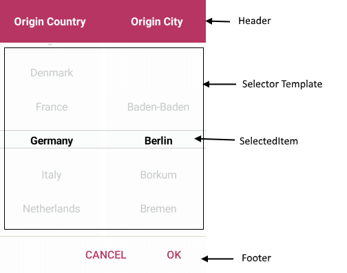

# Visual Structure

Here are described all visual elements used in the Templated Picker for Xamarin.

## Templated Picker Structure before and after selection

## Templated Picker Popup Visual Structure

## Legend

- **Placeholder** - the text visualized before picking a value from the popup. Placeholder could be customized through the PlaceholderTemplate property. For more information review [Templates]() article.
- **DisplayStringFormat** - the text vislualized after an item from the selector is picked.
- **SelectedItem** -  the item which is highlighted when the picker's popup is open. 
- **Header** - the header of the popup For more information review [Templates]() article.
- **SelectorTemplate** - Defines the template used for displaying the selector of the picker. For more information review [Templates]() article.
- **Footer** - the footer of the popup. For more information review [Templates]() article.

## See Also

- [Getting Started]()
- [Templates]()
- [Styling]()