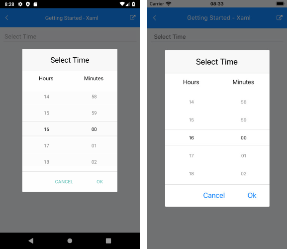

# String Format

Time Picker for Xamarin allows you to use standard or custom time format strings through the SpinnerFormat property. Depending on what format is set, the picker visualizes spinner controls with prepopulated values to be picked.

* **SpinnerFormat**(*string*): Defines the string format for the spinners. The default format is **"g"**.

## Standard Тime Format Strings

The available standard time format strings that can be set to the SpinnerFormat property are described in the table below:

| Supported Standard Time Format String | Description |
| -------- | -------- |
| "G" | Short Date "d" and Long Time "T" |
| "g" | Short Date "d" and Short Time "t" |
| "T" | Long Time Format Specifier |
| "t" | Short Time Format Specifier |

>important You can set only short [Standard Datе and Time Format Strings](https://docs.microsoft.com/en-us/dotnet/standard/base-types/standard-date-and-time-format-strings) to the Time Picker control.

## Custom Time Format String

The available custom time format strings that can be set to the SpinnerFormat property are described in the table below:

| Supported Custom Time Format Strings|
| -------- |
| "d" |
| "dd" |
| "dddd" |
| "h" |
| "hh" |
| "m" |
| "mm" |
| "s" |
| "ss" |

>important You can set only short [Custom Date and Time Format Strings](https://docs.microsoft.com/en-us/dotnet/standard/base-types/custom-date-and-time-format-strings) to the Time Picker control.

## Supported Separators

When SpinnerFormat is set and device culture is changed, the separators used for the format string won't be changed:

| Supported Time Separators Formats |
| -------- |
| "-" |
| "." |
| "'" |
| " " |
| ":" |
| "/" |

## Examples

### SpinnerFormat="H:mm"

```XAML
<telerikInput:RadTimePicker SpinnerFormat="H:mm" />
```

And the result:



## See Also

- [Templates]()
- [Styling]()
- [Commands]()
