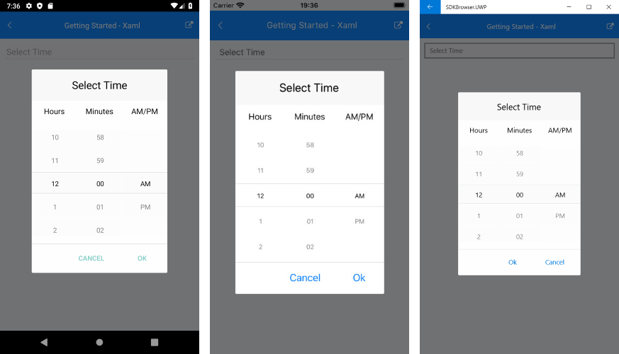

# Getting Started with Time Picker for Xamarin

This article will guide you through the steps needed to add a basic **RadTimePicker** control in your application.

* [Setting up the app](#1-setting-up-the-app)
* [Adding the required Telerik references](#2-adding-the-required-telerik-references)
* [Adding RadTimePicker control](#3-adding-radtimepicker-control)

## 1. Setting up the app

Take a look at these articles and follow the instructions to setup your app:

- [Setup app with Telerik UI for Xamarin on Windows]()
- [Setup app with Telerik UI for Xamarin on Mac]()

## 2. Adding the required Telerik references

You have two options:

* Add the Telerik UI for Xamarin Nuget package following the instructions in [Telerik NuGet package server]() topic.

If you don't want to add the all Telerik.UI.for.Xamarin nuget package, you have the option to add a separate nuget package. For RadTimePicker control you have to install the **Telerik.UI.for.Xamarin.Input** nuget package. This nuget will automatically refer the Telerik.UI.for.Xamarin.Primitives, Telerik.UI.for.Xamarin.Common, and Telerik.UI.for.Xamarin.DataControls nuget packages.

* Add the references to Telerik assemblies manually, check the list below with the required assemblies for **RadTimePicker** component:

| Platform | Assemblies |
| -------- | ---------- |
| Portable | Telerik.XamarinForms.Input.dll<br/>Telerik.XamarinForms.Common.dll<br/>Telerik.XamarinForms.Primitives.dll<br/>Telerik.XamarinForms.DataControls.dll<br/>Telerik.XamarinForms.SkiaSharp.dll |
| Android  | Telerik.XamarinForms.Input.dll<br/>Telerik.XamarinForms.Common.dll<br/>Telerik.XamarinForms.Primitives.dll<br/>Telerik.XamarinForms.DataControls.dll<br/>Telerik.XamarinForms.SkiaSharp.dll |
| iOS      | Telerik.XamarinForms.Input.dll<br/>Telerik.XamarinForms.Common.dll<br/>Telerik.XamarinForms.Primitives.dll<br/>Telerik.XamarinForms.DataControls.dll<br/>Telerik.XamarinForms.SkiaSharp.dll |
| UWP      | Telerik.XamarinForms.Input.dll<br/>Telerik.XamarinForms.Common.dll<br/>Telerik.XamarinForms.Primitives.dll<br/>Telerik.XamarinForms.DataControls.dll<br/>Telerik.XamarinForms.SkiaSharp.dll |

## 3. Adding RadTimePicker control

You could use one of the following approaches:

#### Drag the control from the Toolbox. 

Take a look at the following topics on how to use the toolbox:

* [Telerik UI for Xamarin Toolbox on Windows]()
	
#### Create the control definition in XAML or C#.

The snippet below shows a simple RadTimePicker definition:

<snippet id='timepicker-getting-started-xaml' />
<snippet id='timepicker-getting-started-csharp' />

In addition to this, you need to add the following namespace:

```XAML
xmlns:telerikInput="clr-namespace:Telerik.XamarinForms.Input;assembly=Telerik.XamarinForms.Input"
```
```C#
using Telerik.XamarinForms.Input;
```

This is the result:



>important **SDK Browser** and **Telerik Xamarin Samples** applications contain different examples that show RadTimePicker's main features. For detailed information on this go to [Xamarin Demos Applications]() topic.

## See Also

- [Supported Standard Time Format Strings]()
- [Key Features]()
- [Templates]()
- [Styling]()
