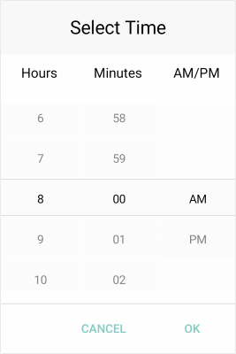

# Overview

**Telerik Time Picker for Xamarin** provides a convenient way for the app users to select a time. Its items are visualized inside a popup. Time Picker control has a number of features which allows you to set a time range, time format and fully customize the dialog appearance such as its header and footer.  

## Key features

* **Spinner Format**: Time Picker for Xamarin allows you to use standard or custom time format string through the TimePicker.SpinnerFormat property. Depending on what format is set, the picker visualizes spinner controls with prepopulated values to be picked. For more information check the [Time Format String]() article in our documentation.

* **Templates**: Time Picker provides templates for its header and footer. Also we have exposed templates for the picker placeholder and display text. For additional info go to [Templates]() article.

* **DisplayString Format**: You can choose what text to be displayed when a time value is selected using the TimePicker DisplayStringFormat property. For more info on this check the [Key Features - DisplayString Format](#displaystring-format) section.

* **Time Range**: RadTime Picker allows you to define a time range when setting minimum and maximum time values and choose a time in between. To learn more about this, visit [Key Features Time Range](#time-range) section.

* **Flexible Styling API**: Take advantage of the styling capabilities of the RadTimePicker control. You can easily style its Spinners, the Popup and its header and footer, the text displayed after time is selected and many [more]().

* **Commands Support**: Time Picker exposes command that allows you to clear the selected time - **Clear Command** and **Toggle Command** that allows you to open and close the dialog. For more information on this check TimePicker's [Commands]() topic.

>tip Check out Time Picker for Xamarin [Getting Started]() help article that shows how to use it in a basic scenario.

## See Also

- [Visual Structure]()
- [Getting Started]()
- [Key Features]()
- [Templates]()
- [Styling]()