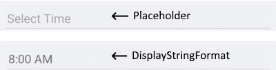
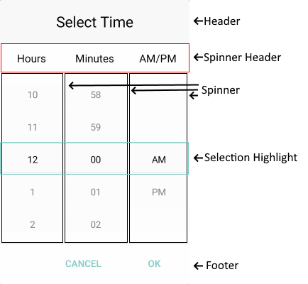

# Visual Structure

Here are described all visual elements used in the Time Picker for Xamarin.

## Time Picker Structure before and after a time value is selected

## Picker Popup Visual Structure

>important More information about Spinners refer to the [RadSpinner help article]().

## Legend ##

- **Placeholder** - the text visualized before picking a time value. Placeholder can be customized through the [PlaceholderTemplate](#placeholdertemplate) property.
- **DisplayStringFormat** - the text visualized after a time value is picked.
- **Header** - the text displayed in the popup header. It can be set to a direct text through the [HeaderLabelText](#popup-styling) property or fully customize the popup header using the [HeaderTemplate](#headertemplate) property
- **SpinnerHeader** - the text visualized for spinner header depending on the values to be picked. For example if the *SpinnerFormatString* is *g* and *AreSpinnerHeadersVisible="True"* The text visualized for spinner header will be **Hours** **Minutes** **AM/PM**.
- **Spinner** - displays items in a list.
- **SelectionHighlight** - highlight the currently selected time when the popup is open.
- **Footer** - the footer of the popup. By default is contains OK and Cancel Buttons. It can be customized through the [FooterTemplate](#footertemplate) property.

## See Also

- [Getting Started]()
- [Key Features]()
- [Time Format Strings]()