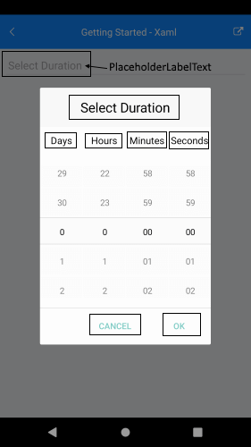

# TimeSpan Picker Localization

RadTimeSpan Picker for Xamarin provides language localization. In short, you can translate the used across the TimeSpan Picker texts to other languages, so that your app can be adapted to different regions.

>important To learn in details about the localization process of Telerik UI for Xamarin components, please go through the common [Localization and Globalization]() topic.

The sections below list all the localization keys used in TimeSpan Picker for Xamarin control.

## TimeSpan Picker Localization string

| Localization Key | Default Value |
| -----------------| ------------- |
| TimeSpanPicker_PlaceholderLabelText  | Select Duration |
| TimeSpanPicker_Popup_HeaderLabelText  | Select Duration |

## Common Picker Localizations strings

| Localization Key | Default Value |
| -----------------| ------------- |
| Picker_DaysSpinnerHeaderLabelText  | Days |
| Picker_HourSpinnerHeaderLabelText  | Hours |
| Picker_MinuteSpinnerHeaderLabelText | Minutes |
| Picker_SecondSpinnerHeaderLabelText  | Seconds |
| Picker_Popup_AcceptButtonText  | OK |
| Picker_Popup_CancelButtonText  | Cancel |

Check in the image below how the localization strings are presented in TimeSpan Picker:

## See Also

* [Localization and Globalization]()
