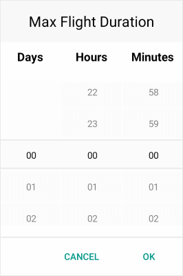

# Overview

**Telerik TimeSpan Picker for Xamarin** provides an easy way to select a time duration. TimeSpan control represents a time interval and allows you to set a time range between two times measured in numbers of days, hours, minutes and seconds. The Flexible Styling API gives you the opportunity to fully customize the dialog appearance such as its header and footer.

## Key features

* **Spinner Format**: TimeSpan Picker for Xamarin allows you to use standard or custom timespan format string through the TimeSpanPicker.SpinnerFormat property. Depending on what format is set, the picker visualizes spinner controls with prepopulated values to be picked. For more information check the [TimeSpan Format String]() article in our documentation.

* **Templates**: TimeSpan Picker provides templates for its header and footer. Also we have exposed templates for the picker placeholder and display text. For additional info go to [Templates]() article.

* **DisplayString Format**: You can choose what text to be displayed when a time interval is selected using the TimeSpanPicker DisplayStringFormat property. For more info on this check the [Key Features - DisplayString Format](#displaystring-format) section.

* **Time Range**: RadTimeSpan Picker allows you to define a time range when setting minimum and maximum time values and choose a time in between. To learn more about this, visit [Key Features Time Range](#timespan-range) section.

* **Flexible Styling API**: Take advantage of the styling capabilities of the RadTimeSpanPicker control. You can easily style its Spinners, the Popup and its header and footer, the text displayed after time is selected and many [more]().

* **Commands Support**: TimeSpan Picker exposes command that allows you to clear the selected time interval - **Clear Command** and **Toggle Command** that allows you to open and close the dialog. More information about Commands support check our help article [here]().

>tip Check out TimeSpan Picker for Xamarin [Getting Started]() help article that shows how to use it in a basic scenario.

## See Also

- [Key Features]()
- [Templates]()
- [Commands]()