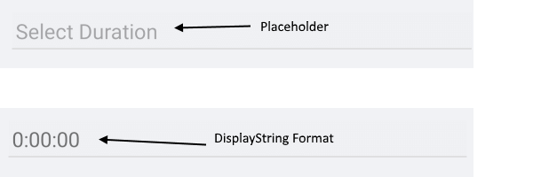
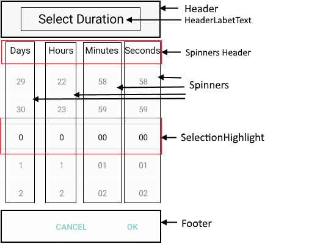

# Visual Structure

Here are described all visual elements used in the TimeSpan Picker for Xamarin.

## TimeSpan Picker Structure before and after time interval selection.

## Picker Popup Visual Structure

>important More information about Spinners refer to the [RadSpinner help article]().

## Legend ##

- **Placeholder** - the text visualized before picking a date/time. Placeholder could be customized through the [PlaceholderTemplate](#placeholdertemplate) property.
- **DisplayStringFormat** - the text vislualized after a date/time is picked.
- **Header** and **HeaderLabelText**- the text displayed in the popup header. It could se set a direct text through the [HeaderLabelText]() property or fully customize the popup header using the [HeaderTemplate](#headertemplate) property.
- **SpinnersHeader** - the text visualized for spinner header depending on the values to be picked. For example if the *SpinnerFormat* is *g* the text visualized for spinner header will be **Days** **Hours** **Minutes** **Seconds**.
- **Spinner** - displays time interval values in a list.
- **SelectionHighlight** - highlisht the current selected time interval when the popup is open.
- **Footer** - the footer of the popup. By default is contains OK and Cancel Buttons. It could be customized through the [FooterTemplate](#footertemplate) property.

## See Also

- [Key Features]()
- [Templates]()
- [Commands]()