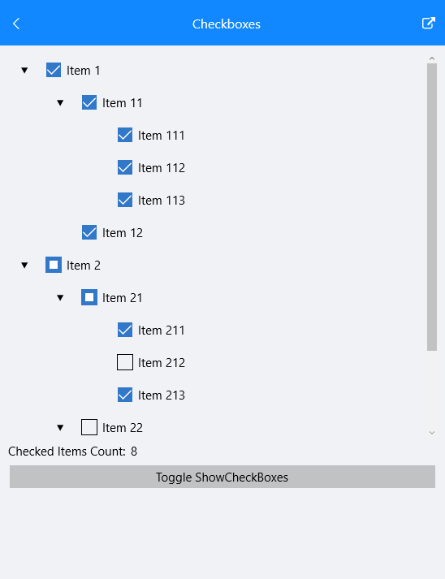
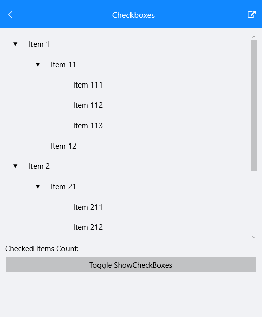

# CheckBox elements #

The RadTreeView supports showing **CheckBox** elements and checking specific items from its **ItemsSource**. The checked items are added to the **CheckedItemsCollection** property of the control. You can also control the Visibility of the **CheckBox** elements as well as their state propagation.
 
## CheckBox State Propagation

You can control the state propagation by setting the CheckBoxMode property of the RadTreeView. The **CheckBoxModes** enum consists of the following values:

* **None**: The CheckBox would not be present.
* **Individual**: The CheckBox state will affect only the individual item.
* **Propagate**: The CheckBox state of the children items will affect the parent item. In case all items within a parent nodes are checked - it will be with checked state as well. If all items are not checked, the parent item will not be checked. If only some of the children items are checked, the parent item will be shown with an indeterminate state. 

Here is an example of how you can set the property:

	        <dataControls:RadTreeView ItemsSource="{Binding SmallSource}"
                                      CheckBoxMode="Propagate"
                                      x:Name="tv">
            </dataControls:RadTreeView>

Here is a picture that show the different states of the CheckBox:

  
## CheckedItemsCollection

The control exposes a collection of all the checked items. You can subscribe to its CollectionChanged event and keep track of the checked items:

        public TreeViewCheckboxes ()
		{
            this.SmallSource = new ObservableCollection<Item>();
            this.InitSources();
            this.BindingContext = this;
            InitializeComponent ();
            this.tv.HierarchyAdapter = new TreeViewDemoAdapter();
			//subscribe to the CollectionChanged event of the collection
            tv.CheckedItems.CollectionChanged += CheckedItems_CollectionChanged;
        }

        private void CheckedItems_CollectionChanged(object sender, System.Collections.Specialized.NotifyCollectionChangedEventArgs e)
        {
            var ci = this.tv.CheckedItems as TreeViewItemsCollection;
			//show the number of checked items in a Label
            this.CheckedItemsCount.Text = ci.Count.ToString();
        }

## CheckBoxes Visibility

The CheckBox visibility can be controlled through the **CheckBoxMode** property. Setting it to "None" would remove the appearance of these elements. Here is the appearance of the **control** when the **CheckBoxMode** is set to **None**:

>important You can check a runnable demo in the **Features** section of the **RadTreeView** component in the **SDK Samples Browser application**(can be found in the Examples folder of your local *Telerik UI for Xamarin* installation)

## See Also

* [Commands]()
* [Expand/Collapse]()
* [Theming]()