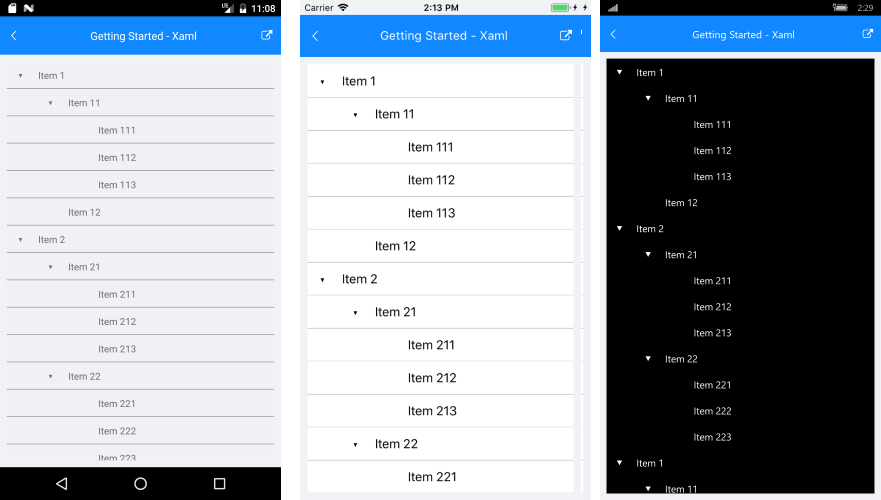

# Getting Started

This example will guide you through the steps needed to add a basic **RadTreeView** control in your application.

>Before you proceed, please, it might be useful to take a look at these articles and follow the instructions to set up your app:

>- [Setup on Windows]()
>- [Setup on Mac]()
>- [Required Telerik Assemblies]()

## Example

Once your application is created, you are ready to add a **RadTreeView** control.

The simplest and fastest way to include the control is by simply defining it like this in XAML:

	<dataControls:RadTreeView x:Name="tv" ItemsSource="{Binding SourceCollection}"/>

You have to add the following namespaces:

	xmlns:dataControls="clr-namespace:Telerik.XamarinForms.DataControls;assembly=Telerik.XamarinForms.DataControls"

As you can notice, the **ItemsSource** property of the control needs to be set. The collection we have is representing a hierarchical view and this is the reason for using the RadTreeView control for this setup. Here is how a single item from the collection is created:

            this.SourceCollection.Add(new Item()
            {
                Name = "Item 1",
                Children = new List<Item>()
                    {
                        new Item()
                        {
                            Name = "Item 11",
                            Children = new ObservableCollection<Item>()
                            {
                                new Item()
                                {
                                    Name = "Item 111",
                                },
                                new Item()
                                {
                                    Name = "Item 112"
                                },
                                new Item()
                                {
                                    Name = "Item 113"
                                }
                            }
                        },
                        new Item()
                        {
                            Name = "Item 12"
                        }
                    }
            });

An important step for the control to load its items correctly is to set its **HierarchyAdapter** property:
  
	this.tv.HierarchyAdapter = new TreeViewDemoAdapter();

The custom hierarchy adapter should implement the **Telerik.XamarinForms.Common.IHierarchyAdapter** interface. Here is how the **TreeViewDemoAdapter** class is defined:

	public class TreeViewDemoAdapter : IHierarchyAdapter
    {
        public object GetItemAt(object item, int index)
        {
            return (item as Item).Children[index];
        }

        public IEnumerable<object> GetItems(object item)
        {
            return (item as Item).Children ?? Enumerable.Empty<object>();
        }
    } 

Where the Item class is defined as:

    public class Item : INotifyPropertyChanged
    {
        string name;
        public string Name
        {
            get
            {
                return this.name;
            }
            set
            {
                if (this.name != value)
                {
                    this.name = value;
                    this.OnPropertyChanged();
                }
            }
        }

        public IList<Item> Children { get; set; }

        public event PropertyChangedEventHandler PropertyChanged;

        public Item()
        {
            this.Children = new ObservableCollection<Item>();
        }

        public void OnPropertyChanged([CallerMemberName] string propertyName = "")
        {
            var eh = this.PropertyChanged;
            if (eh != null)
                eh.Invoke(this, new PropertyChangedEventArgs(propertyName));
        }

        public override string ToString()
        {
            return this.Name;
        }
    }

Here is the appearance of the **RadTreeView** control once the upper steps have been accomplished:

>important You can check a runnable demo in the **Features** section of the **RadTreeView** component in the **SDK Samples Browser application**(can be found in the Examples folder of your local *Telerik UI for Xamarin* installation)

## See Also

* [Commands]()
* [Expand/Collapse]()
* [CheckBoxes]()
* [Theming]()