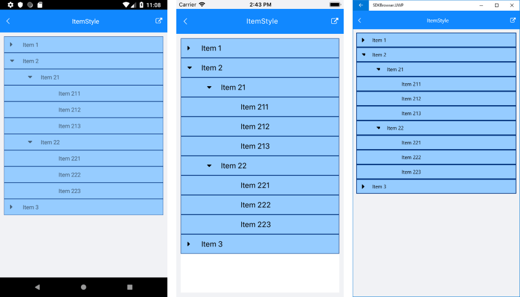

# Item Style

RadTreeView component provides styling mechanism for customizing the look of its items. To utilize it you would need to set **ItemStyle** property of the control to TreeViewItemStyle object.

TreeViewItemStyle exposes the following styling options: 

* **BackgroundColor** (*Color*): sets the background of the item(s).
* **BorderColor** (*Color*): sets the color of the border.
* **BorderWidth** (*double*): defines the width of the borer.
* **BorderLocation** (*Location*): describes an enumeration describing where the border should be visible.

### Location

This enumeration contains the following members:

- **None** - the border should not be visualized.
- **Top** - the border should be visualized only at the top side.
- **Bottom** - the border should be visualized only at the bottom side.
- **Left** - the border should be visualized only at the left side.
- **Right** - the border should be visualized only at the right side.
- **All** (default value) - the border should be visualized all around the item.

### Example

The snippet below shows a sample RadTreeView definition with **ItemStyle** applied:

<snippet id='treeview-styling-itemstyle-xaml'/>

And here is the end result:

>important You can find a working demo labeled **ItemStyle** in the TreeView/Styling folder of the [SDK Samples Browser application](). 

## See Also

* [Theming]()
* [ItemStyleSelector]()
