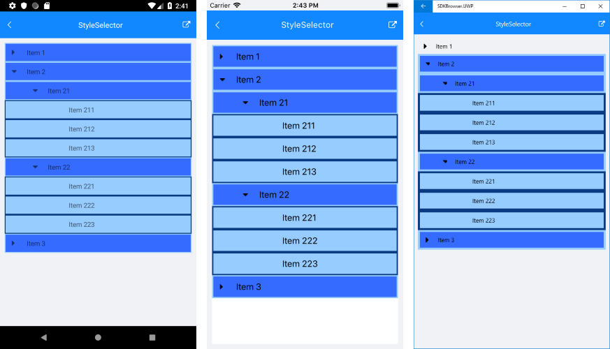

# ItemStyle Selector

RadTreeView component exposes conditional styling feature. It allows users to apply a different **Style** to each item depending on a specific condition. 

## Example

The following example will demonstrate how to apply different styles on parent items and leaf items.

First, create a sample TreeViewStyleSelector class and override its OnSelectStyle method - in it you will receive all the information on the current item through *TreeViewStyleContext* object, so you could return different styling per your preferences:

<snippet id='treeview-examplestyleselector'/>

All that is left is to set this custom style selector to the **ItemStyleSelector** property of the TreeView control:

<snippet id='treeview-styling-itemstyleselector-xaml'/>

This is how the **RadTreeView** control will look like when conditional styling is used.

>important **SDK Browser** application contains an example that shows StyleSelector feature in RadTreeView cotrol. You can find the application in the **Examples** folder of your local **Telerik UI for Xamarin** installation.

## See Also

* [Theming]()
* [Item Style]()
