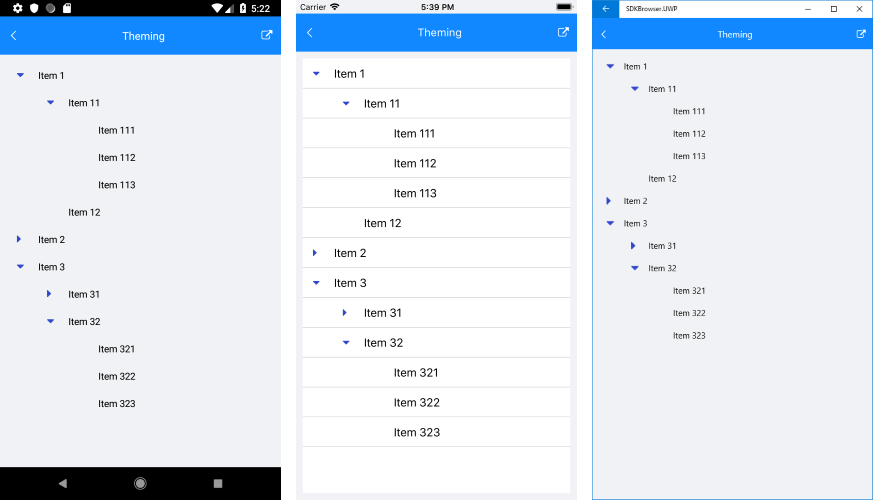

# Theming #

By applying a **Telerik Theme** to your Telerik controls you can easily propagate a common look and feel throughout your application. The RadTreeView makes no exception and supports the theming mechanism which is really straightforward to set. 

As a first step, make sure that you have familiarized yourself with the [Themes Overview]() topic. As a next step, you can proceed with merging the required ResourceDictionaries into your application's resources as explained in the [Setting a Theme]() article.

Once you have completed the above steps, all you need to do is set the **StyleClass** property of the RadTreeView so that the TelerikTheme is applied:

<snippet id='treeview-styling-theming-xaml' />

You could check how RadTreeView looks below:

You can always modify the default theme resources in order to style the control so that it perfectly fits the tone of your application. For more information, check the [Create a Custom Theme]() topic.

## See Also

* [Commands]()
* [Expand/Collapse]()
* [CheckBoxes]()