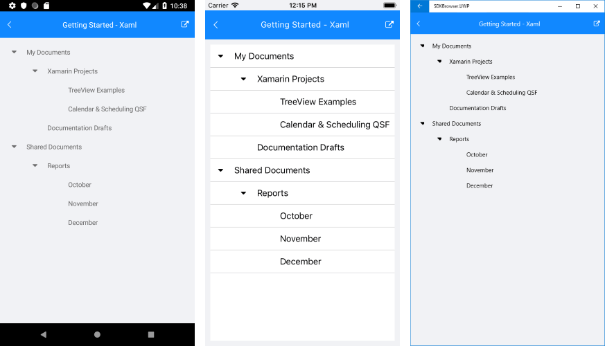

# Getting Started

This article will guide you through the steps needed to add a basic **RadTreeView** control in your application.

* [Setting up the app](#1-setting-up-the-app)
* [Adding the required Telerik references](#2-adding-the-required-telerik-references)
* [Adding RadDataGrid control](#3-adding-radtreeview-control)

## 1. Setting up the app

Take a look at these articles and follow the instructions to setup your app:

- [Setup app with Telerik UI for Xamarin on Windows]()
- [Setup app with Telerik UI for Xamarin on Mac]()

## 2. Adding the required Telerik references

You have two options:

* Add the Telerik UI for Xamarin Nuget packages following the instructions in [Telerik NuGet package server]() topic.

* Add the references to Telerik assemblies manually, check the list below with the required assemblies for **RadTreeView** component:

| Platform | Assemblies |
| -------- | ---------- |
| Portable/Standard | Telerik.XamarinForms.Common.dll <br/> Telerik.XamarinForms.DataControls.dll <br/> Telerik.XamarinForms.Primitives.dll|
| Android  | Telerik.Xamarin.Android.Common.dll <br/> Telerik.Xamarin.Android.Data.dll <br/> Telerik.Xamarin.Android.Input.dll <br/> Telerik.Xamarin.Android.List.dll <br/> Telerik.Xamarin.Android.Primitives.dll <br/> Telerik.XamarinForms.Primitives.dll <br/> Telerik.XamarinForms.Common.dll <br/> Telerik.XamarinForms.DataControls.dll |
| iOS      | Telerik.Xamarin.iOS.dll  <br/> Telerik.XamarinForms.Primitives.dll <br/> Telerik.XamarinForms.Common.dll <br/> Telerik.XamarinForms.DataControls.dll |
| UWP      | Telerik.Core.dll <br/> Telerik.Data.dll <br/> Telerik.UI.Xaml.Controls.Data.UWP.dll <br/> Telerik.UI.Xaml.Input.UWP.dll <br/> Telerik.UI.Xaml.Primitives.UWP.dll <br/> Telerik.XamarinForms.Common.dll <br/> Telerik.XamarinForms.DataControls.dll <br/> Telerik.XamarinForms.Primitives.dll|

## 3. Adding RadTreeView control

You could use one of the following approaches:

#### Drag the control from the Toolbox. 

Take a look at the following topics on how to use the toolbox:

* [Telerik UI for Xamarin Toolbox on Windows]()
* [Telerik UI for Xamarin Toolbox on Mac]()	

#### Create the control definition in XAML:

```XAML
<telerikDataControls:RadTreeView x:Name="treeView" ItemsSource="{Binding Source}" />
```

In addition to this, you need to add the following namespace:

<snippet id='xmlns-telerikdatacontrols' />

As you can notice, the **ItemsSource** property of the control needs to be set. The collection we have is representing a hierarchical view and this is the reason for using the RadTreeView control for this setup. 

First, let's use a simple *Item* business object which holds its sub items inside *Children* collection:

<snippet id='treeview-getting-started-item' />

Then, create a ViewModel containing a collection of Items objects that will be used as ItemsSource of the TreeView:

<snippet id='treeview-getting-started-viewmodel' />

An important step for the control to load its items correctly is to apply **TreeViewDescriptor(s)**. The TreeViewDescriptor basically defines the data items' hierarchy as well as how each item is visualized through the properties listed below:

* TargetType - the type of the data item the descriptor refers to;
* DisplayMemberPath - the name of the property that is displayed for this data item;
* ItemsSourcePath - the path to the list containing the sub items;
* ItemTemplate - you could customize the visual appearance of each item type through the ItemTemplate property of the descriptor;

Here is an example how the TreeViewDescriptor is applied:

<snippet id='treeview-getting-started-xaml' />

Lastly, set the *ViewModel* class as BindingContext:

<snippet id='treeview-getting-started-setviewmodel' />

Here is the appearance of the **RadTreeView** control once the upper steps have been accomplished:



>important You can check a runnable demo in the **Getting Started** section of the **RadTreeView** component in the **SDK Samples Browser application**(can be found in the Examples folder of your local *Telerik UI for Xamarin* installation)

## See Also

- [Commands]()
- [Expand/Collapse]()
- [CheckBoxes]()
- [Theming]()