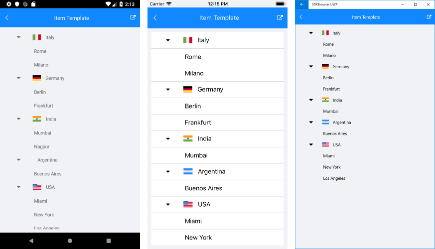

# Item Template #

RadTreeView can be populated with various types of objects (string, any business objects, etc.). You can customize the visualization of the views in the ItemsSource of the control using the ItemTemplate property of the TreeViewDescriptors. The template could contain any view that you can use to display the data.

The following example shows how to populate the ItemsSource with business items and customize their appearance.

First, create the needed business objects that will be the items of the TreeView. For the example there will be *Country* type with subitems of *City* type:

* Country definition: 

<snippet id='treeview-itemtemplate-country' />

* City definition:

<snippet id='treeview-itemtemplate-city' />

Then, create a ViewModel where the items are defined:

<snippet id='treeview-itemtemplate-viewmodel' />

Add the TreeView definition to your page. Since there are two types of items (Country and City), two TreeViewDescriptors should be added.  For the *Country* item there is a separate ItemTemplate defined, so that the Country.Icon is visualized as well:

<snippet id='treeview-itemtemplate-xaml' />

Here is the ImageSourceConverter class which basically maps the icon's path according to the target platform:

<snippet id='treeview-itemtemplate-converter' />

All that is left, is to set the BindingContext to the ViewModel:

<snippet id='treeview-itemtemplate-setviewmodel' />

Here is how the TreeView looks with custom ItemTemplate:

>important You can check a runnable demo in the **Features** section of the **RadTreeView** component in the **SDK Samples Browser application**(can be found in the Examples folder of your local *Telerik UI for Xamarin* installation)

## See Also

* [Expand/Collapse]()
* [Commands]()
