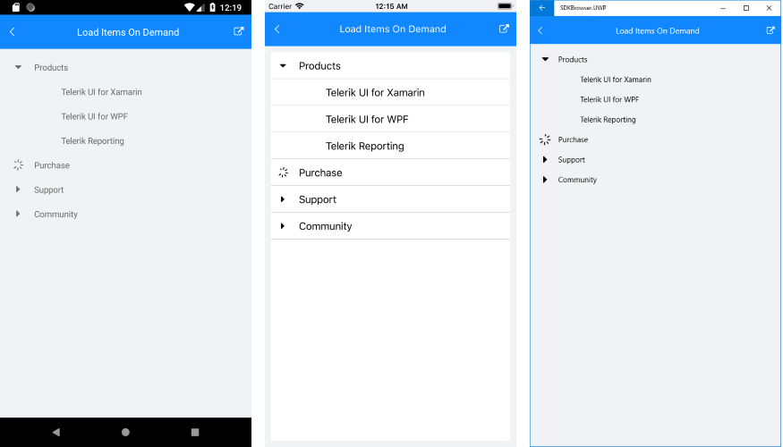

# Load on Demand #

Load On Demand feature allows you to delay the population of RadTreeView and load subitems only when they’re requested, thus saving computing resources and improving the initial performance of your app.  

The Load on Demand mechanism is implemented in such a way that as soon as the end-user tries to expand an item, the treeview receives a notification that a load on demand operation is requested and a busy indicator is displayed for the respective item. When the requested items are loaded, and the operation is marked as finished, the busy indicator is hidden and the items are visualized in the TreeView.

In order to enable the load on demand feature, you would need to utilize the **LoadOnDemand** command of RadTreeView as demonstrated in the example below:

First, let's create a sample Category class which represents the root items of the TreeView and holds its subitems inside its Children property:
 
<snippet id='treeview-loadondemand-businessobject' />

Then, create a ViewModel with a sample Source property which contains the root items of the TreeView. You would also need to create a Command for handling the load on demand scenario.

<snippet id='treeview-loadondemand-viewmodel' />

>note IsLoadOnDemandEnabled method is called when each item is initialized and defines whether a load-on-demand feature is enabled for this item.

Finally, define RadTreeView with the needed TreeViewDescriptors as well as the LoadOnDemandCommand applied:

<snippet id='treeview-loadondemand-xaml' />

All that is left, is to set the BindingContext to the ViewModel:

<snippet id='treeview-loadondemand-setviewmodel' />

Here is how the TreeView looks when load-on-demand is requested:

>note The sample here demonstrates only one-level hieararchy, however, in a real scenario you could use multi-level hieararchy with lazy loading without a problem.

>important You can check a runnable demo in the **Features** section of the **RadTreeView** component in the **SDK Samples Browser application**(can be found in the Examples folder of your local *Telerik UI for Xamarin* installation)

## See Also

* [Expand/Collapse]()
* [Commands]()
