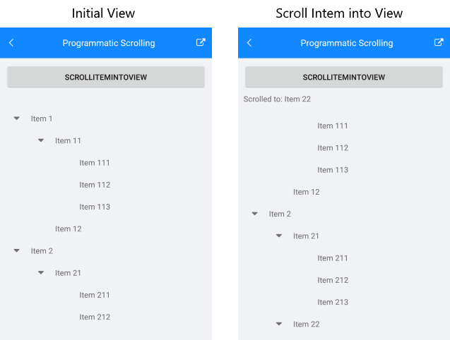

# Programmatic Scrolling #

RadTreeView exposes the following method for programmatic scrolling to a specific data item: 

* **bool ScrollItemIntoView(object item)**: Attempts to bring the specified data item into the view. Returns false in case the item is not available (cannot be found in the ItemsSource or any of its parents is not expanded).
 
## Example

Here is a sample definition of the TreeView control:

<snippet id='treeview-programmatic-scrolling-xaml'/>

Inside ScrollItemIntoViewClicked event handler get the concrete item you'd need to navigate to and call **ScrollItemIntoView** method of the TreeView:

<snippet id='treeview-programmaticscrolling-code'/>
	
And the end result:

#### Figure 1: Scrolling item into View

>important You can check a runnable demo in the **Features** section of the **RadTreeView** component in the **SDK Samples Browser application**(can be found in the Examples folder of your local *Telerik UI for Xamarin* installation)

## See Also

* [Expand/Collapse]()
* [Commands]()
