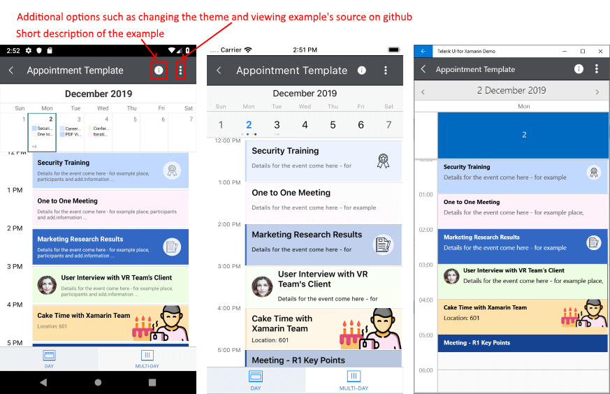
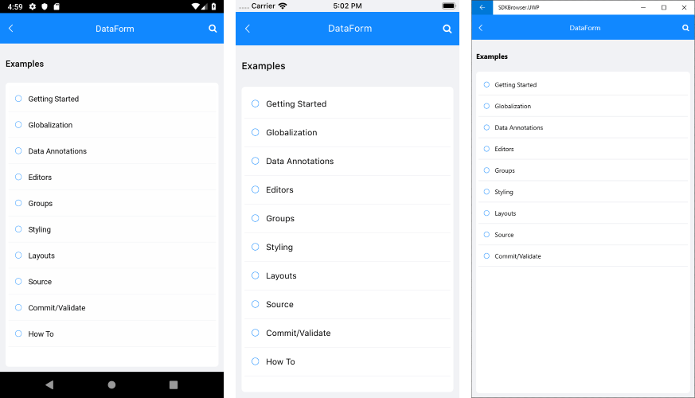

# Telerik UI for Xamarin Demo Applications

**Telerik UI for Xamarin** provides an easy-to-use infrastructure with many fully-featured examples demonstrating our Xamarin controls. You can review the source code of each example and get familiar with the configuration possibilities that each provides.

There are two sets of demos showing Telerik Xamarin.Forms controls: the **Telerik UI for Xamarin Samples** application and the **SDK Browser** application. In this topic, we describe how to use them and explain their differences.
	
## Telerik UI for Xamarin Samples Application

The **Telerik UI for Xamarin Samples** is the application you can find in the app stores (Google Play, Apple App Store and  Windows Store). It is highly polished and has many scenario-specific use cases designed to show off a subset of features for each component.

You can access the Xamarin Samples application in the following ways:

* If you have already installed **Telerik UI for Xamarin**, navigate to the **/[installation-path]/Telerik UI for Xamarin [version]/QSF/** folder and open the `QSF.sln` file;
* You can explore the code directly in the [Xamarin Samples repository on GitHub](https://github.com/telerik/telerik-xamarin-forms-samples/tree/master/QSF);
* You can install it from the corresponding app store ([Google Play](https://play.google.com/store/apps/details?id=com.telerik.xamarin&hl=en), [Apple App Store](https://apps.apple.com/dm/app/telerik-ui-for-xamarin-examples/id1083924868) or [Windows Store](https://www.microsoft.com/en-us/p/telerik-ui-for-xamarin-demo/9pld1kn2tcxs)).

The image below shows the Xamarin Samples application main view with all the Telerik UI for Xamarin controls. There are the **Latest** and **Featured** sections that give a quick overview of the features and recently introduced components.

The following images show a concrete example from the Xamarin Samples application (Calendar &amp; Scheduling Appointment Template example):

### Telerik UI for Xamarin Samples Application Dark Mode

The Telerik UI for Xamarin Samples application has a dark mode support on Android and on iOS. You can change the app theme by clicking on a button. 

Here is how the Xamarin Samples application looks when Dark Mode is applied:

## SDK Browser Application

The SDKBrowser is a set of examples that explain how to use the features of a control. Contrary to the [Xamarin Samples application](#telerik-ui-for-xamarin-samples-application), the SDKBrowser shows the components in their pure form without adding extra styling and polishing. It's the go-to source for "how do I use X in Y control". Most of the code snippets available in the documentation are directly generated from the examples in the SDKBrowser (you can see special comments in the code for this).

You can access the SDKBrowser application in the following ways:

* If you have already installed **Telerik UI for Xamarin**, navigate to the **/[installation-path]/Telerik UI for Xamarin [version]/Examples/Forms** folder and open the `SDKBrowser.sln` file;
* You can directly explore the code in the [SDKBrowser Examples repository on GitHub](https://github.com/telerik/xamarin-forms-sdk/tree/master/XamarinSDK/SDKBrowser/SDKBrowser/Examples).

	> Repository Note: When cloning a repository, you can restore the Telerik assemblies references in one of three ways:
	>* Copy and paste the **Binaries** folder from the UI for Xamarin installation folder to the **xamarin-forms-sdk/XamarinSDK folder** in your local copy of the repository, 
	>* Update the references directly;
	>* Use the [Telerik NuGet server]() and install the Telerik.UI.for.Xamarin package.

The image below shows the SDKBrowser main view with all the controls listed:

Clicking on any control will navigate to a page containing categories with all the examples related to that component. Every control has a Getting Started category where you can learn how to use it in a basic scenario (in XAML and in code-behind). 

## See Also

- [System Requirements]()
- [Getting Started on Windows]()
- [Getting Started on Mac]()
