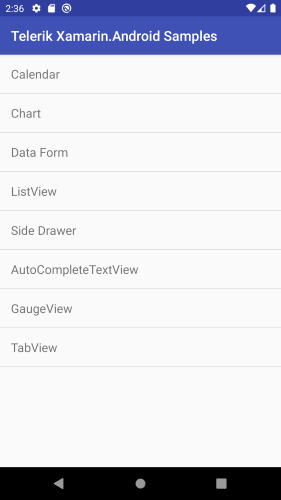
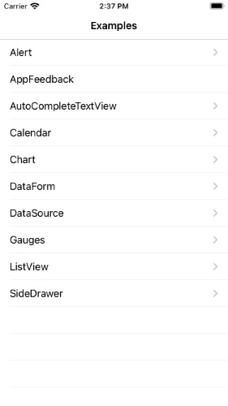

# Telerik UI for Xamarin.Android and Xamarin.iOS Native Examples

**Telerik UI for Xamarin** provides an easy-to-use infrastructure with many fully featured examples demonstrating our Xamarin controls. You can review the source code of each example and get familiar with the configuration possibilities that each provides.

## Native-only Examples

Solutions that show how to use the controls when developing through **Xamarin.Android** or **Xamarin.iOS** are included in the Telerik UI for Xamarin zip file provided for manual installation. 

Telerik_UI_for_Xamarin_[version]_[license].zip, where [version] marks the release and [license] is replaced with Dev license, is available for download from the [Downloads section of your Telerik account](https://www.telerik.com/account/product-download?product=UIXAM). Unzip the archive and go to Examples folder - Xamarin.Android and Xamarin.iOS solutions are available in separate folders - Android and iOS, respectively.

In addition, the native-only examples are included as part of the [Telerik UI for Xamarin MSI installation](). You can find the solutions in the  "[installation-path]/Telerik UI for Xamarin [version]/Examples" folder. 

>tip Visit the [Native Controls Wrappers]() section for more information on Telerik Xamarin.Android and Xamarin.iOS components.

## Xamarin.Android Samples

Telerik UI for Xamarin.Android Samples contains sample scenarios using the Telerik UI for Xamarin.android controls. Telerik UI for Xamarin suite includes Xamarin.Android wrappers built on top of truly native Android components. 

> For more details please check the [Xamarin.Android Wrappers]() article.

## Xamarin.iOS Examples

Telerik UI for Xamarin.iOS Examples contains sample scenarios using the Telerik UI for Xamarin.iOS controls. Telerik UI for Xamarin suite includes Xamarin.iOS wrappers built on top of truly native iOS components, allowing you to build unique and visually stunning iOS applications. 

> For more details please check the [Xamarin.iOS Wrappers]() article.

## See Also

- [System Requirements]()
- [Getting Started on Windows]()
- [Getting Started on Mac]()

