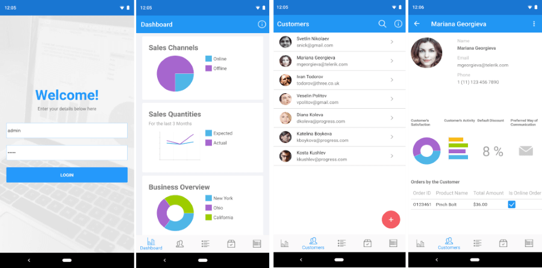
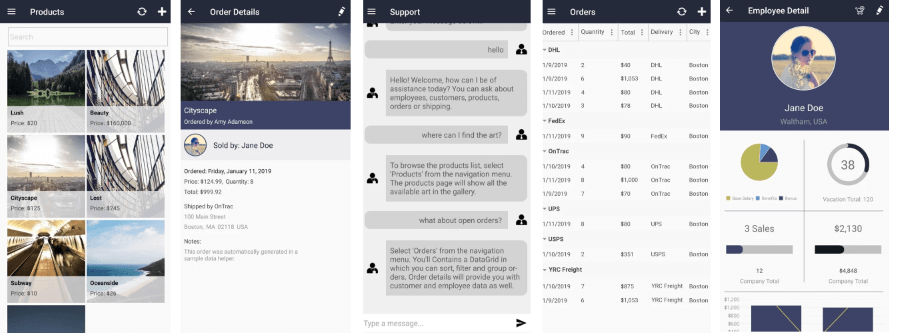

# Telerik UI for Xamarin Sample Applications

Discover the power of Telerik UI for Xamarin with several fully functional, real-world Xamarin.Forms application examples. 

The applications are developed using the Telerik UI for Xamarin controls. These applications are valuable resource for best programming practices in Xamarin or as a blueprint for your next Xamarin.Forms application.

## Telerik ERP App

The Telerik ERP (Enterprise Resource Management Application) is a showcase software that demonstrates how you can view and process different financial transactions and processes. From clients to orders and vendors, this application provides a quick and efficient way to manage your business.

The application is created with the powerful Telerik UI for Xamarin controls and demonstrates how one can architecture real-world line of business application. It uses the most popular Telerik UI for Xamarin controls such as Charts, Data Grid, ListView, Inputs, BusyIndicator and also features MVVM utilizing the MVVM Cross framework.
	
The "Telerik UI for Xamarin ERP Application" is in the app stores (Google Play, Apple App Store and  Windows Store).

The application can be accessed in the following ways:

* You can explore the code directly in the [Samples Application repository on GitHub](https://github.com/telerik/telerik-xamarin-forms-samples/tree/master/ERP);
* You can install it from the corresponding app store 
	* [Google Play](https://play.google.com/store/apps/details?id=com.telerik.ErpApp), 
	* [Apple App Store](https://apps.apple.com/us/app/telerik-erp/id1450527259) 
	* [Windows Store](https://www.microsoft.com/bg-bg/p/telerik-erp/9nmk4g533qlh?rtc=1&activetab=pivot:overviewtab).

The image below shows how the Telerik ERP app looks:

## Telerik CRM App
The Telerik CRM is a cross-platform Xamarin.Forms demo application developed within the business context of a functioning art gallery and its customer relations. The application is built from the ground up using a combination of Azure App Services for the backend, Azure Bot Framework for an in-app support chat service and Telerik UI for Xamarin for a beautiful and feature-rich client experience.

The application provides a seamless user-experience which enables the users to easily explore information about employees, customers, products and orders, as well as interact with a support chat bot that will guide them through the application and answer various questions about finding the appropriate information.

The application can be accessed in the following ways:

* You can explore the code directly in the [Samples Application repository on GitHub](https://github.com/telerik/telerik-xamarin-forms-samples/tree/master/ArtGalleryCRM);
* You can install it from the corresponding app store 
	* [Google Play](https://play.google.com/store/apps/details?id=com.telerik.ArtGalleryCRM), 
	* [Apple App Store](https://apps.apple.com/us/app/art-gallery-crm/id1449462263?ls=1) 
	* [Windows Store](https://www.microsoft.com/bg-bg/p/telerik-crm/9pbnqz08r0c8).

The image below shows how the Telerik ERP app looks:

## Telerik ToDo App

The Telerik ToDo is a simple, yet elegant customer-facing application designed to cover various task management scenarios. The application’s frontend is build entirely with Telerik UI for Xamarin controls, while the backend is powered by a variety of interesting technologies such as Entity Framework Core, SQLite and MMVMFresh. It features some of the most popular controls such as ListView, DataForm, SideDrawer, TreeView, SlideView and many more.

The app scenario is about organizing notes, ideas, thoughts without losing focus.

* Create notes.
* Organize notes into categories.
* View your notes in card and linear view.
* Search notes.

The application can be accessed in the following ways:

* You can explore the code directly in the [Samples Application repository on GitHub](https://github.com/telerik/telerik-xamarin-forms-samples/tree/master/ToDo);
* You can install it from the corresponding app store 
	* [Google Play](https://play.google.com/store/apps/details?id=com.telerik.TodoApp), 
	* [Apple App Store](https://apps.apple.com/us/app/telerik-to-do/id1475654512) 
	* [Windows Store](https://www.microsoft.com/en-us/p/telerik-to-do/9ns4dbcsdzh6).

The image below shows how the Telerik ERP app looks:

## Telerik Tagit App

The Telerik TagIt app turns the photo gallery of a mobile device into a searchable database by allowing users to easily tag and caption their photos for quick and easy retrieval. The application is built on Xamarin.Forms with the help of Microsoft Azure’s Computer Vision API and Telerik UI for Xamarin. 

The Telerik TagIt application is an ideal example of an AI-powered app written in Xamarin.Forms. The app uses Microsoft Azure's Computer Vision API — part of the Cognitive Services suite — for building the backend with artificial intelligence and machine learning. 

The application can be accessed in the following ways:

* You can explore the code directly in the [Samples Application repository on GitHub](https://github.com/telerik/telerik-xamarin-forms-samples/tree/master/TagIt);
* You can install it from the corresponding app store 
	* [Google Play](https://play.google.com/store/apps/details?id=com.telerik.tagit), 
	* [Apple App Store](https://apps.apple.com/us/app/telerik-tagit/id1310584457) 
	* [Windows Store](https://www.microsoft.com/bg-bg/p/telerik-tagit/9pb07plrwpfs).

The image below shows how the Telerik ERP app looks:

## See Also

- [System Requirements]()
- [Getting Started on Windows]()
- [Getting Started on Mac]()
