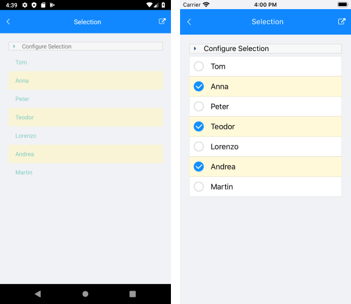

# Explore Control Features

Once you have your first control [working in your project](), it's time to see what else it can do. This article provides a short overview of how to get started with finding control functionality and features.

## Demos

To get an overview of what each control offers, the fastest way will be to explore our [Live Demos](https://www.telerik.com/support/demos#mobile) availabile free in [Google Play Store](https://play.google.com/store/apps/details?id=com.telerik.xamarin&hl=en) and [App Store](https://apps.apple.com/dm/app/telerik-ui-for-xamarin-examples/id1083924868).

## Documentation

Each control __documentation__ consists of different sections to help you get started with the control and explore its key features. For some of the more complex ones you can also find additional articles that will help you get the best out of it. Things like __feature usage__ and __styling options__.

>caption Figure 1: Typical control documentation structure


## Control Features

In this example we are going to look [Selection] () as one of the key features in the ListView control.

**RadListView** component exposes selection feature. It allows users to select one or many items out of the ItemsSource of the control. This feature provides both visual and programmatic feedback for the actions of the user. 

This article will show the basic properties RadListView provides for working with selection.

### Selection Configuration

RadListView provides three selection modes, which allow you to manipulate the type of selection. This is controlled by the **SelectionMode** property which has the following entries:

- **SelectionMode** (*Telerik.XamarinForms.DataControls.ListView.SelectionMode*): 
	- None - This mode doesn't allow users to select an item. 
	- Single - This is the default selection mode. It allows users to select only one item.
	- Multiple - This mode allows users to select more than one item. 

Check below how you can set **SelectionMode** in XAML and code-behind:

```XAML
<telerikDataControls:RadListView x:Name="listView"
                                 SelectionMode="Multiple" />
```
```C#
var listView = new RadListView();
listView.SelectionMode = Telerik.XamarinForms.DataControls.ListView.SelectionMode.Multiple;
```
			
You can also configure how the selection to be triggered by the end users through the **SelectionGesture** property:

- **SelectionGesture** (*Telerik.XamarinForms.DataControls.ListView.SelectionGesture*):
	- Tap - Users need to tap on an item to select it. This is the default SelectionGesture value;
	- Hold - Users need to tap & hold on an item to select it.

```XAML	
<telerikDataControls:RadListView x:Name="listView"
                                 SelectionGesture="Hold" />
```
```C#
var listView = new RadListView();
listView.SelectionGesture = Telerik.XamarinForms.DataControls.ListView.SelectionGesture.Hold;
```

### Getting Selected Items

RadListView exposes the following properties for getting the selected item or items in case of multiple selection:

- **SelectedItems** (*ObservableCollection&lt;object&gt;*): Read-only collection used to get the currently selected items;
- **SelectedItem** (*object*): Specifies the last selected item of the ListView.

### Selection Events
	
- **SelectionChanged**: An event that is triggered whenever the SelectedItems collection is changed. The __SelectionChanged__ event handler receives two parameters:
	* The sender argument which is of type object, but can be cast to the __RadListView__ type.
	* A __NotifyCollectionChangedEventArgs__ object which provides information on the collection changed event. For more details check [NotifyCollectionChangedEventArgs Class](https://docs.microsoft.com/en-us/dotnet/api/system.collections.specialized.notifycollectionchangedeventargs) topic.

### Styling

You can customize the way selected items look by applying **SelectedItemStyle** property to the RadListView instance. For detailed information on the approach go to [Items Styles]() topic in ListView documentation.

Here is how the **RadListView** control looks like on different platforms when multiple items are selected:

#### __Figure 2: Result in iOS and Android__


## Next Steps

Now that you have the Telerik UI for Xamarin controls running in your project, you may want to explore their features, customize their behavior or change their appearance. Below you can find guidance on getting started with such tasks:

* [Change control appearance]()
* [Further information]()

## See Also

* [First Steps]()
* [Progress Virtual Classroom](https://www.telerik.com/account/support/virtual-classroom)
