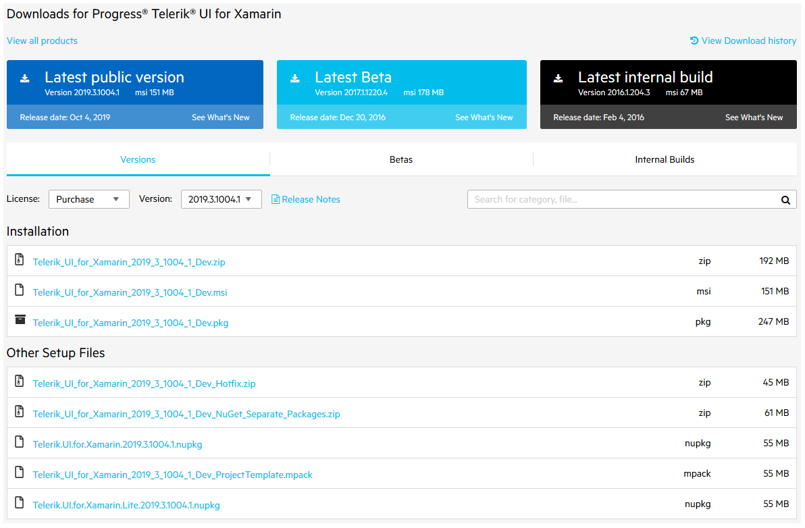
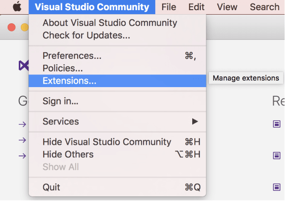
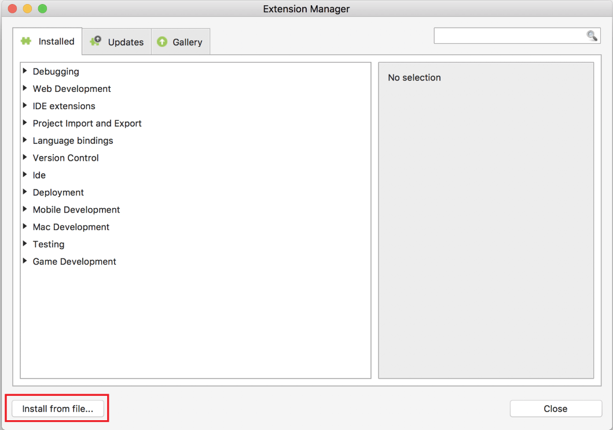
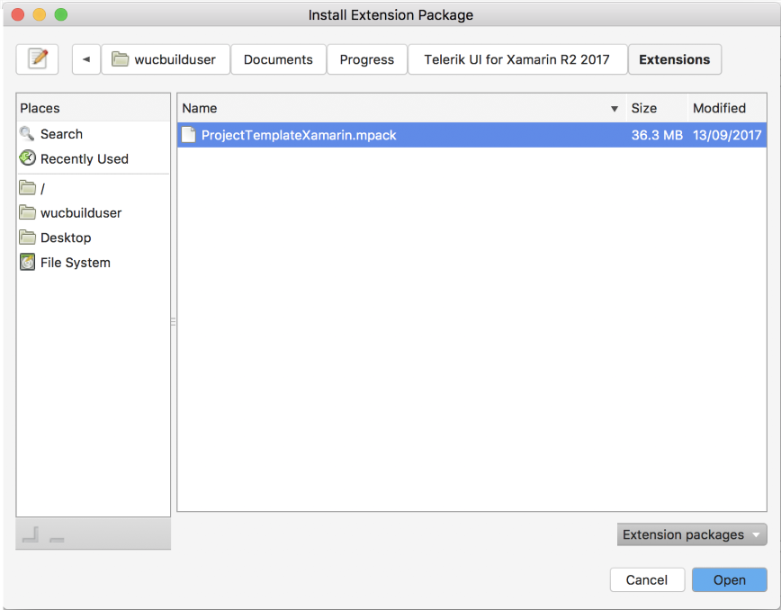
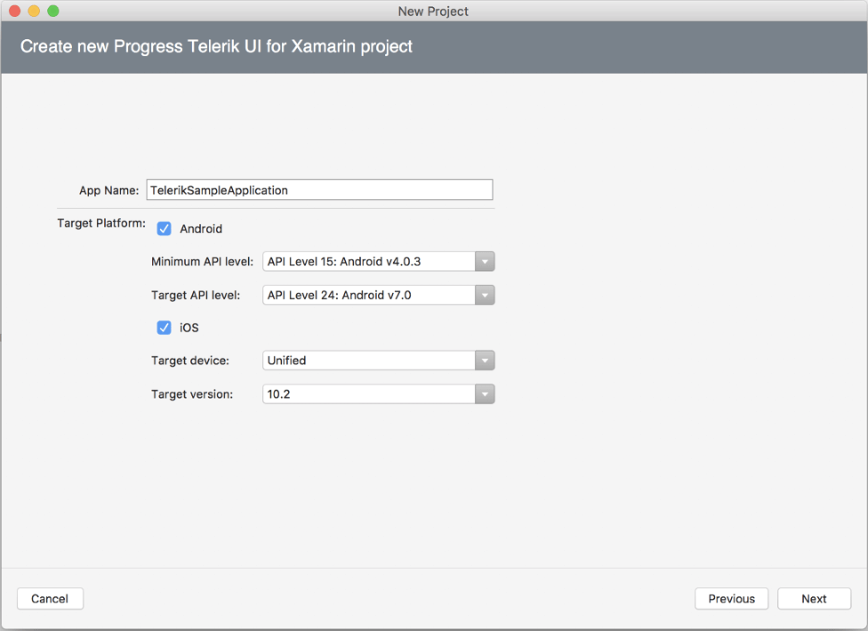
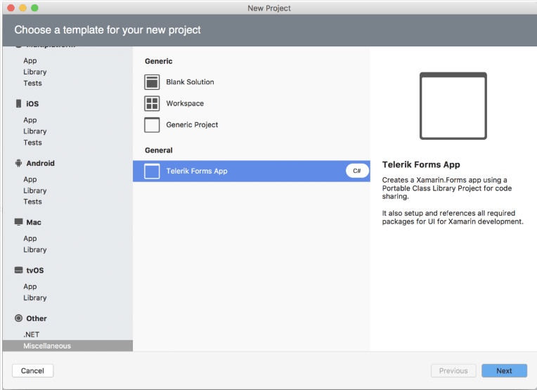

# First Steps

This article will guide you through the basics of __Telerik UI for Xamarin__ and how to start using the suite on __Mac__.

Once you have your first simple Xamarin control up and running, take a look at the __Next Steps__ section to explore other control functionality.

For additional resources you can also review the Related Articles section on the right.

## Download the Controls

When you have an active trial or developer license, you can download the following files:

* Standalone installation
* Assemblies for manual installation
* NuGet packages
* Old versions

>If you are not a customer, you can [download a free, fully functional trial](https://www.telerik.com/download-trial-file/v2-b/ui-for-xamarin?file=pkg) and the same options will apply to you as well.

>tip Make sure you have already read the [System Requirements]() article before you proceed.

Follow the steps below in order to download the installation files:

1. Log into your [Telerik account](https://www.telerik.com/account/) and click on the __Downloads__ tab.

	#### __Figure 1: Downloads tab__
	

2. Select __Progress Telerik UI for Xamarin__ product title.

3. Download the Installation __pkg__ and __mpack__ files.

	#### __Figure 2: Download installers__
	
	
	Once you have installed the pkg file, you will also need to install the mpack file in order to use the Visual Studio Extensions. 
4. Open the Visual Studio **Extension Manager** and select the *Install form file...* option. __Figure 3__ shows how to access the Extension Manager.

	#### __Figure 3: Accessing Visual Studio Extensions__
	

5. Once you have accessed the **Extension Manager**, the following dialog will appear and you should look for the **Install from file** option.

	#### __Figure 4: Reaching the Extension Manager__
	

6. Navigate to the **ProjectTemplateXamarin.mpack** file. 

	#### __Figure 5: The ProjectTemplate location__
	

	If the add-in is successfully added to Visual Studio, you should see it in the **IDE** extensions section.

7. **Restart Visual Studio for Mac** to complete the installation.

## Create a Project with Telerik UI for Xamarin

1. Now you can create a new project using the Telerik Project Template. Select which platform(s) your application targets and the wizard will automatically reference all required Telerik binaries and packages.

	#### __Figure 6: Create New Project Dialog__
	

2. Select the **Telerik Forms App** template which can be found in *Other > Miscellaneous* section.

	#### __Figure 7: Telerik Forms App template__
	

## Next Steps

Now that you have downloaded and installed Telerik UI for Xamarin, and created your first project its time to add the Telerik UI for Xamarin control. Below you can find guidance on getting started with that:

- [Add Control to Your Project]()
- [Explore Control Features]()
- [Change control appearance]()
- [Further information]()

## See Also

- [System Requirements]()
- [Telerik NuGet Server]()
- [Required Android Support Libraries]()
- [Getting started on Windows]()