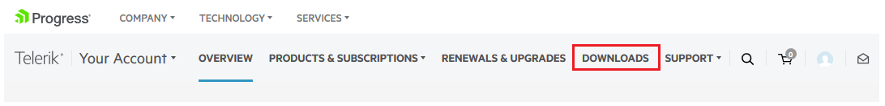

# First Steps

This article will guide you through the basics of __Telerik UI for Xamarin__ and how to start using the suite on __Mac__.

Once you have your first simple Xamarin control up and running, take a look at the __Next Steps__ section to explore other control functionality.

For additional resources you can also review the Related Articles section on the right.

## Download the Controls

When you have an active developer license, you can download the following files:

* Standalone installation
* Assemblies for manual installation
* NuGet packages
* Old versions

>tip Make sure you have already read the [System Requirements](#macos) article before you proceed.

Follow the steps below in order to download the installation files:

1. Log into your [Telerik account](https://www.telerik.com/account/) and click on the __Downloads__ tab.

	##### __Figure 1a: Downloads tab__
	

2. Select __Progress Telerik UI for Xamarin__ product title.

3. Download the Installation __.pkg__ file.

	##### __Figure 3a: Download installers__
	
	
4. Install __Progress Telerik UI for Xamarin__ 
	
	Since MacOS Catalina, downloaded installers and packages are quarantined. If you try to just open the **pkg** file, you may see a popup preventing you from installing it. The easiest solution is to
	1. Right-click on the **.pkg** file you downloaded in Step 3
	2. Select "Open With"
	3. Select "Installer" (see Fig 4a). 

	##### __Figure 4a: Open With -> Installer__
	

	> For a more permanent solution, open the Mac OS [Settings -> Security & Privacy](https://support.apple.com/library/content/dam/edam/applecare/images/en_US/macos/Mojave/macos-mojave-system-preferences-security-general-require-disable-dark.jpg) settings panel and select **Allow apps downloaded from App Store and Identified developers**. 

5. **Restart Visual Studio for Mac** to complete the installation.

## Next Steps

Now that you have downloaded and installed Telerik UI for Xamarin, and created your first project its time to add the Telerik UI for Xamarin control. Below you can find guidance on getting started with that:

- [Add Control to Your Project]()
- [Explore Control Features]()
- [Change control appearance]()
- [Further information]()

## See Also

- [System Requirements]()
- [Telerik NuGet Server]()
- [Required Android Support Libraries]()
- [Getting started on Windows]()
