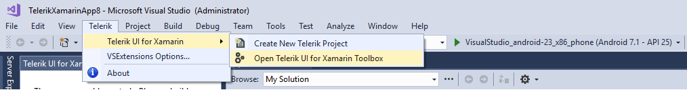
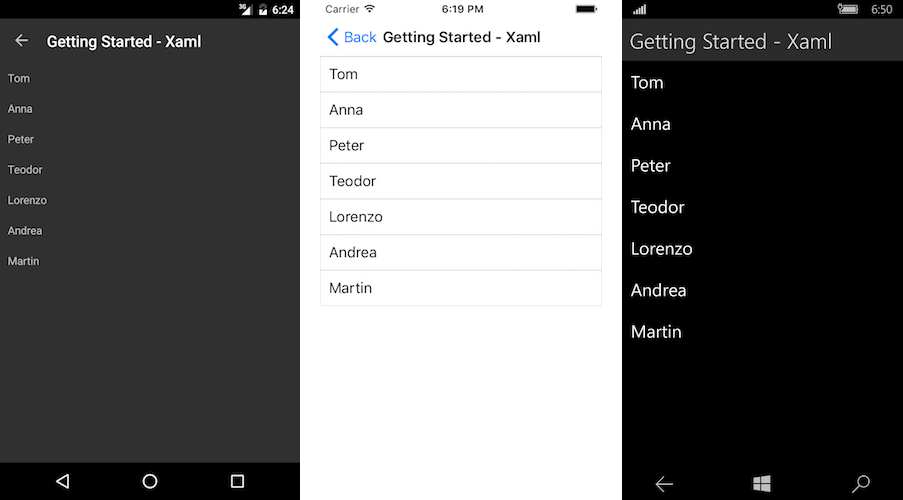

#  Add a Control to Your Project

## Show the Telerik Toolbox
In order to show the Telerik Toolbox in Visual Studio and add a control, you should navigate to Telerik > Telerik UI for Xamarin > Open Telerik UI for Xamarin Toolbox.
	
#### __Figure 1: Show the Telerik UI for Xamarin Toolbox__

	
## Add a Control to Your Project
Embedding the controls from the suite is made as easy as possible and all you need to do is simply drag one of the controls within your XAML file. This will add the control definition and will also map the needed namespace declarations. For the purpose of this example we will add [RadListView] () Control.

#### __Figure 2: Adding Telerik controls to your application__

	
	
## Populating RadListView with data

First thing you need to do is to create a data and view model classes:

#### Example 1: Populating RadListView with data in C#.

```C#
		public class SourceItem
		{
			public SourceItem(string name)
			{
				this.Name = name;
			}
			public string Name { get; set; }
		}
		public class ViewModel
		{	
			public ViewModel()
			{
				this.Source = new List<SourceItem> { new SourceItem("Tom"), new SourceItem("Anna"), new SourceItem("Peter"), new SourceItem("Teodor"), new SourceItem("Lorenzo"), new SourceItem("Andrea"), new SourceItem("Martin") };
			}
			public List<SourceItem> Source { get; set; }
		}
```

Update the setup of the ListView you created in __Figure 6__ to be like:

#### Example 2: Update the setup of the ListView in XAML.

```XAML
	<telerikDataControls:RadListView x:Name="listView" ItemsSource="{Binding Source}">
		<telerikDataControls:RadListView.BindingContext>
			<local:ViewModel />
		</telerikDataControls:RadListView.BindingContext>
		<telerikDataControls:RadListView.ItemTemplate>
			<DataTemplate>
				<telerikListView:ListViewTemplateCell>
					<telerikListView:ListViewTemplateCell.View>
						<Grid>
							<Label Margin="10" Text="{Binding Name}" />
						</Grid>
					</telerikListView:ListViewTemplateCell.View>
				</telerikListView:ListViewTemplateCell>
			</DataTemplate>
		</telerikDataControls:RadListView.ItemTemplate>
	</telerikDataControls:RadListView>
```

The results should be:
#### __Figure 3: Result in Android, iOS and Windows__



## Next Steps

Now that you have your first Telerik UI for Xamarin control running, you may want to explore the different features, behavior and appearances. Below you can find guidance on getting started with such tasks:

- [Explore Control Features]()
- [Change control appearance]()
- [Further information]()

## See Also

- [System Requirements]()
- [Telerik NuGet Server]()