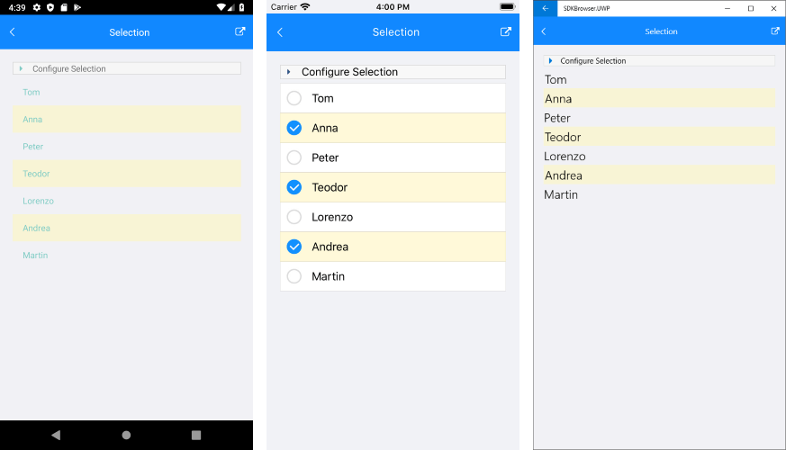

# Explore Control Features

Once you have your first control [working in your project](), it's time to see what else it can do. This article provides a short overview of how to get started with finding control functionality and features.

## Demos

To get an overview of what each control offers, the fastest way will be to explore our [Live Demos](https://www.telerik.com/support/demos#mobile) availabile free in [Google Play Store](https://play.google.com/store/apps/details?id=com.telerik.xamarin&hl=en), [App Store](https://apps.apple.com/dm/app/telerik-ui-for-xamarin-examples/id1083924868) and [Microsoft Store](https://www.microsoft.com/en-us/store/p/telerik-ui-for-xamarin-examples/9pld1kn2tcxs).

## Documentation

Each control __documentation__ consists of different sections to help you get started with the control and explore its key features. For some of the more complex ones you can also find additional articles that will help you get the best out of it. Things like __feature usage__ and __styling options__.

>caption Figure 1: Typical control documentation structure


## Control Features

In this example we are going to look [Selection] () as one of the key features in the ListView control.

The **RadListView** component exposes selection feature that allows users to select one or many items out of the ItemsSource of the control. This feature provides both visual and programmatic feedback for the actions of the user. The following members are related to the selection: 

- **SelectionGesture** (*SelectionGesture*): Gets or sets the gesture triggering the selection.
	- Tap
	- Hold
- **SelectionMode** (*SelectionMode*): Gets or sets the mode of the selection.
	- None - This mode doesn't allow users to select an item. To enable it the **SelectionMode** property should be set to **None**.
	- Single - This is the default selection mode. It allows users to select only one item.
	- Multiple - This mode allows users to select more than one item. To enable it the **SelectionMode** property should be set to **SelectionMode.Multiple**.
	
- **SelectedItems** (*ObservableCollection&lt;object&gt;*): Gets or sets the currently selected items.
- **SelectedItem** (*object*): Gets the last selected item.
- **SelectionChanged**: An event that is triggered whenever the SelectedItems collection is changed.

#### Example 1: Definition of the ListView control:

```XAML
<Grid>
    <Grid.RowDefinitions>
        <RowDefinition Height="Auto"/>
        <RowDefinition/>
    </Grid.RowDefinitions>

    <StackLayout Padding="10">
        <Label Text="Set selection mode:" FontSize="Medium"/>
        <Picker x:Name="selectionModePicker" AutomationId="SelectionModePicker"/>
        <Label Text="Set selection gesture:" FontSize="Medium"/>
        <Picker x:Name="selectionGesturePicker" AutomationId="SelectionGesturePicker"/>
    </StackLayout>

    <telerikDataControls:RadListView  x:Name="listView" Grid.Row="1">
        <telerikDataControls:RadListView.SelectedItemStyle>
            <telerikListView:ListViewItemStyle BackgroundColor="#88888888"/>
        </telerikDataControls:RadListView.SelectedItemStyle>
    </telerikDataControls:RadListView>
</Grid>
```

and lets create a simple data for the ListView component and a method called InitializePickers in which we can add the modes and gestures we want to use.

#### Example 2: Create a simple data and add the modes and gestures we will use:

```C#
public Selection()
{
    this.InitializeComponent();
    listView.ItemsSource = new List<string> { "Tom", "Anna", "Peter", "Teodor", "Lorenzo", "Andrea", "Martin" };
    this.InitializePickers();
}

private void InitializePickers()
{
    selectionModePicker.Items.Add("None");
    selectionModePicker.Items.Add("Single");
    selectionModePicker.Items.Add("Multiple");
    selectionModePicker.SelectedIndexChanged += this.OnSelectionModeChanged;
    selectionModePicker.SelectedIndex = 1;

    selectionGesturePicker.Items.Add("Tap");
    selectionGesturePicker.Items.Add("Hold");
    selectionGesturePicker.SelectedIndexChanged += this.OnSelectionGestureChanged;
    selectionGesturePicker.SelectedIndex = 0;
}
```

We can control the behavior of the RadListView's selection when changing the selection of the Pickers. The methods that are related with the Picker functionality are **OnSelectionGestureChanged** and **OnSelectionModeChanged**. We use them to change the SelectionGesture/SelectionMode of the RadListView.

#### Example 3: Implement the methods: 

```C#
private void OnSelectionGestureChanged(object sender, EventArgs e)
{
    switch ((sender as Picker).SelectedIndex)
    {
        case 0:
            listView.SelectionGesture = SelectionGesture.Tap;
            break;
        case 1:
            listView.SelectionGesture = SelectionGesture.Hold;
            break;
    }
}

private void OnSelectionModeChanged(object sender, EventArgs e)
{
    switch ((sender as Picker).SelectedIndex)
    {
        case 0:
            listView.SelectionMode = SelectionMode.None;
            break;
        case 1:
            listView.SelectionMode = SelectionMode.Single;
            break;
        case 2:
            listView.SelectionMode = SelectionMode.Multiple;
            break;
    }
}
```

### Single Selection

This is how the **RadListView** control will look like when the single selection mode is set.
#### __Figure 1: Result in Android, iOS and Windows__


### Multiple Selection

Here is how the **RadListView** control will look like when the multiple selection mode is set.
#### __Figure 2: Result in Android, iOS and Windows__



>important **SDK Browser** application contains an example that shows Selection feature in RadListView cotrol. You can find the application in the **Examples** folder of your local **Telerik UI for Xamarin** installation.

## Next Steps

Now that you have the Telerik UI for Xamarin controls running in your project, you may want to explore their features, customize their behavior or change their appearance. Below you can find guidance on getting started with such tasks:

* [Change control appearance]()
* [Further information]()

## See Also

* [First Steps]()
* [Progress Virtual Classroom](https://www.telerik.com/account/support/virtual-classroom)
